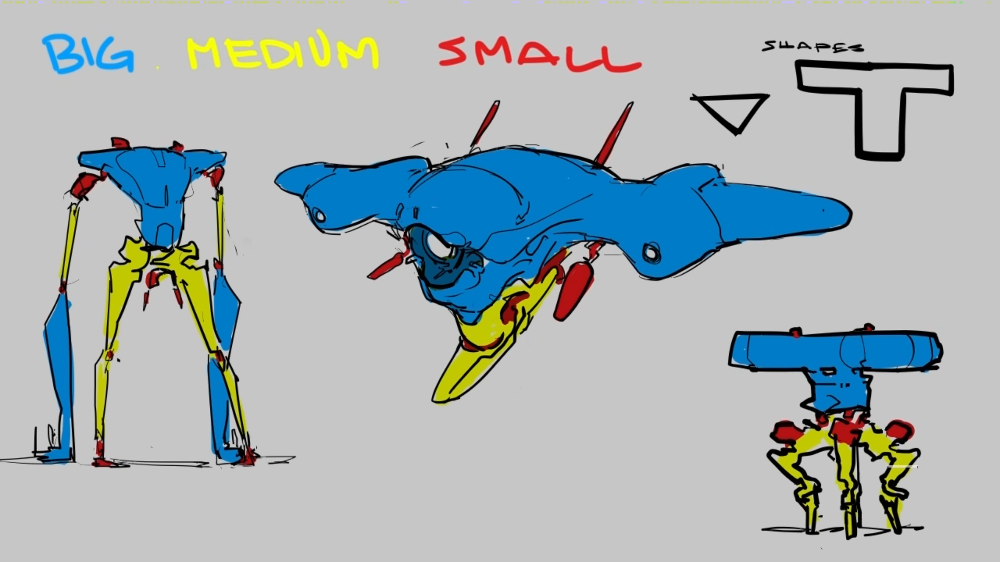

#######################################
Basic Design and Composition Principles
#######################################

********
Contrast
********

Contrast defines the differenct between two states. While it can be anything, contrast in temperature,
contrast in volume or emotional contrast, we care most about value contrast, colour contrast and contrast
in shape when designing. Psycologically, contrast helps us to define, sort and understand our surroundings.
When creating anything, we can use this knowledge to shape the perception, story and emotion percieved by
an audience.

Further reading:

    * `The contrast effect on wikipedia <https://en.wikipedia.org/wiki/Contrast_effect>`_
    * `Examples of the contrast effect <https://effectiviology.com/contrast-effect/>`_
     
.. _bigMediumSmall:

Big - Medium - Small
====================

    Source: Sinix Design Design Theory

Big - Medium - Small, Primary - Secondary - Tertiary, First Read - Second Read - Third Read are
all different names for the same design principle: Make your composition easy to read and understand
by splitting it into shapes of different sizes.

A viewer will recognize the big shapes first, followed by the smaller and only in the end look at 
the details. You can use this to create a 'flow', hierarchy and even story in you images. Further,
this principle will make your image interesting, appealing and nice to look at.

Make sure your composition has at least all three types of shapes in it. The size of each of these
types should be clearly different then the next smaller or bigger shape. All other design principles
will work in tandem with big

Further reading & watching:

    * Videos:
        * `Sinix Design on Big Medium Small <https://www.youtube.com/watch?v=ZluGXgpdJj4>`_
        * `Neil Blevins on Primary, Secondary, Tertiary <https://www.youtube.com/watch?v=6IojuePYIHo>`_
    * Articles: 
        * `Lino Drieghe on Concept Art <https://www.linodriegheart.com/design-principles-in-concept-art-and-design/>`_
        * `Neil Blevins on Primary, Secondary, Tertiaries <http://neilblevins.com/cg_education/primary_secondary_and_tertiary_shapes/primary_secondary_and_tertiary_shapes.htm>`_

.. _80_20rule:

70 - 30 Rule:
=============

This rule is related to the big - medium - small rule. You can also find it called the 80-20 rule. According
to this rule dividing a space or form into subshapes of 70 and 30% of the primary form's area results in a
more appealing image than other ratios. It is also used for the distribution of detail: Leaving 70 percent of the 
area with low detail and filling the 30 with smaller details.

.. hint::
    The numbers in this rule aren't incredibly important. The only thing to remember when creating objects,
    shapes and pictures is that our perception likes contrast. - Following this notion, making sure to divide,
    compose and add details in a manner that creates areas of contrast will always result in a more appealing
    result than aimlessly cluttering the shape, form or composition.

Further reading & watching:

    * Articles:
        * `Crave Painting on compostition <https://cravepainting.com/blog/composition-in-the-arts>`_
        * `Lino Drieghe on Concept Art <https://www.linodriegheart.com/design-principles-in-concept-art-and-design/>`_
        * `The70-30 rule in character design <https://artist-advice.tumblr.com/post/154817307701/some-people-have-asked-how-i-went-about-drawing>`_
    * Videos:
        * `Common SciFi Mistakes ( and how to improve ) <https://www.youtube.com/watch?v=AkYnoaSB5xw>`_

Further reading and watching:
=============================

    * Videos:
        * `Analyzing Shape Language and Design of HOB <https://www.youtube.com/watch?v=crCZEQEgFZ0>`_
        * `Sinix on shape appeal <https://www.youtube.com/watch?v=P6yJO9gKSAI>`_
        * `Spaceship design by FZD <https://www.youtube.com/watch?v=0YrPpraXkBY&list=PLvNv1kRvuSwLYS2CkHTDS6-zVKSoUYzJO&index=5>`_
        

************************
Frame Composition Basics
************************

Most of the time, your 3D objects will be seen on a 2D screen or image. This will give you the possibility
to create an appealing composition for your viewers. These frame composition basics are by no means exhaustive
and should be seen as a starting point for growing your own visual awareness and skill.
All of these 'rules' should more be seen as 'tools' that you can, but don't have to use. Most of them rely
heavily on the psychological principles of the :ref:`gestaltPrinciples` which should **always** be considered
when using any of these visual tools.

.. hint::
    The raise of VR makes it seem like the frame composition might be outdated for 3d objects some day.
    However, most principles used for compositions in 2D frames can and should be used to create physical
    frames in your 3D world. - This is much harder than doing it in 2D and would be to much for this 
    course. If you are interested, there are lots of articles and scientific papers on this topic released
    each year.

.. https://www.youtube.com/watch?v=yI04tSpEB_Y
.. https://www.youtube.com/watch?v=O8i7OKbWmRM

The Rule Of Thirds
==================

The golden ratio divides a space by roughly 1.64.

The rule of thirds divides an image into 3 spaces vertically and 3 spaces horizontally. It then places
the major lines and focus points on these intersections.

.. warning::
    While the rule of thirds is a nice tool to create an interesting composition quickly, you won't get
    very far using only this tool. Used only by itself, the rule of thirds produces bland and uninteresting
    compositions.

Further reading:

    * `Wikipedia on the Rule Of Thirds <https://en.wikipedia.org/wiki/Rule_of_thirds>`_
    * `SLR Lounge on the Rule Of Thirds <https://www.slrlounge.com/glossary/rule-of-thirds-definition/>`_
    * `Why the Rule Of Thirds leads to bad conpositions <https://www.youtube.com/watch?v=AJ7fahM5sBQ>`_

.. https://www.youtube.com/watch?v=RrxO6SZAVb4

Dynamic Symmetry and Major Area Division:
=========================================

Jay Hambridge, formulated 1920 but used long before that.

Simple erklärung: Bilddiagonale und darauf senkrecht stehende diagonalen die in den Ecken beginnen bilden an 
ihren Schnittpunkten 'Eyes' bzw areas of focus.
Lines dividing the image through the eyes are used as verticals.

Berechnung: 
    Large Side / Small Side = Ratio 
    Smaller Side / Ratio = Abstand von der Kante. Vertikale = Ankunft der Reziproken

    MAD: Just divide the smaller side by 2
    ( and do the Dynamic symmetry for this grid as well. )

Baroque Diagonal - Bot Left To Up Right: More 'pleasing', is known to people from perspective lines and reading
left to right

Sinister Diagonal - Up Left To Bot Right

Use Parallel Angles! ( Dynamic Symmetry encourages using the gamut of angles it provides )
Check Figure Ground Relationship

Major area division: Sub-rectangles get subdivided with grids again ( i.e. Quads can get nice diagonals that way )

Further reading & watching

    * Articles:
        * `What is Dynamic ymmetry ( all lines explained ) <http://larmonu.larmonstudios.com/dynamic-symmetry/>`_
        * `How to use Dynamic Symmetry in composition <https://photographycourse.net/dynamic-symmetry/>`_
    * Videos:
        * `Dynamic Symmetry for filmmakers <https://www.youtube.com/watch?v=3pLKYt91qOw>`_
        * `How filmmakers can compose shots mathematically <https://youtu.be/3pLKYt91qOw>`_
        * `How to easily understand the ratios in Dynamic Symmetry <https://www.youtube.com/watch?v=dhpgzQ-iyss&t=99s>`_

.. _shapeAndSilhouette:

Shape, Silhouette
=================

Clarity
=======
Area of highest contrast!! - Focal point, subject, figure ground relationship

