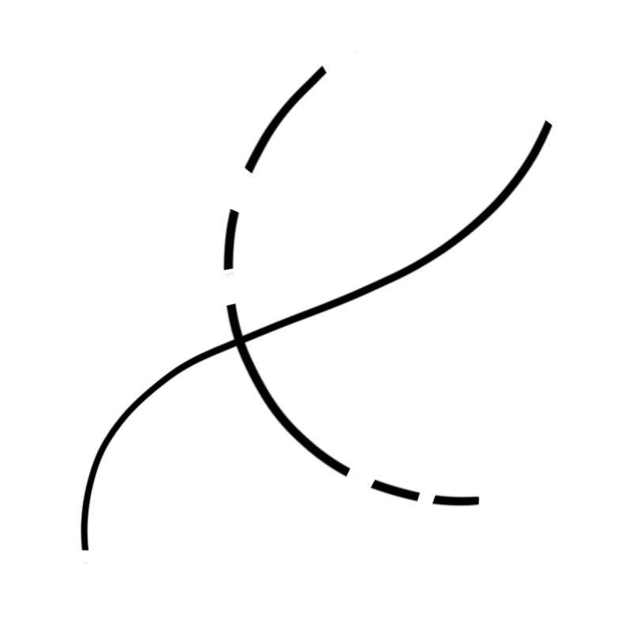

.. _gestaltPrinciples:

##################
Gestalt Principles
##################

Founded on Max Wertenheimers “Experimental Studies of the Perception of Movement” in 1912, a group of German and
Austrian psychologists tested and formulated a set of rules of human perception. Around 1920, these got known as Gestalt
Psychology and later Gestalt Theory.

    Gestalt Theory - and by this, the Gestalt Principles - describe human perception as the innate skill of making sense and
    giving order to chaos.

Different groups of psychologists expermiented with those principles, tested them and proved the theories to come up
with the rules listed down below.
By now, we know that each of these rules are a major factor in how an image or shape is percieved.

Further Reading:
    * Videos:
        * `Extra Credits on Gestalt Psychology in Games <https://www.youtube.com/watch?v=c1qdyszaeTU>`_
        * `Gestalt Psychology for Beginners <https://www.youtube.com/watch?v=FryaH599ec0>`_
    * Articles:
        * `Gestalt Principles on Wikipedia <https://en.wikipedia.org/wiki/Gestalt_psychology>`_
        * `Canva on gestalt principles <https://www.canva.com/learn/gestalt-theory/>`_
        * `Gestalt Principles in UX <https://www.usertesting.com/blog/gestalt-principles>`_
  

**********
Principles
**********

Instead of writing long and detailed explanations, I tried to keep this section down to an example as well as a one
liner that is easy to remember. If you want to learn more about these 'rules', check out the links posted above. You can
also visit your local library for a bunch of information on these laws.

.. note::
    Mny of these principles do not only work in a static image but also temporally. Some of them are the basis for
    editing in films and many other time-based media.

Figure Ground Relationship
==========================

To clearly recognize any shape, we need to be able to differenciate it from its background. In areas of great contrast,
our perceptions sorts shapes automatically in 'fgure' and (back-)'ground'. These relation ships also happen in
negative space.

.. image:: https://cloud.netlifyusercontent.com/assets/344dbf88-fdf9-42bb-adb4-46f01eedd629/dbb8a350-f50a-4868-899e-0c985c5435cd/04-figure-ground.png
    :width: 49%

.. image:: https://sf-fan.de/wp-content/uploads/2011/12/dark_knight_rises_xlg-500x739.jpg
    :width: 49%

Similarity
==========

Similar looking objects will be percieved as belonging together. In contrast, objects that stand out among a crowd will
be percieved as 'wrong' or 'intruding'.

.. image:: https://www.creativebeacon.com/wp-content/uploads/2010/06/Picture-91.png
    :width: 49%

.. image:: https://preview.redd.it/szw3m901j3141.png?width=960&crop=smart&auto=webp&s=463099af35b218d883e5bbe605a6c825d01177e0
    :width: 49%

Proximity
=========

Elements that are positioned close to each other are likely percieved as belonging together. This effect is enhanced
when the elements look similar as well.

.. image:: https://cloud.netlifyusercontent.com/assets/344dbf88-fdf9-42bb-adb4-46f01eedd629/5db63462-1e88-4889-9573-49358486840f/07-proximity.png
    :width: 49%

.. image:: https://www.pluggedin.com/wp-content/uploads/2019/12/Cloudy-With-a-Chance-of-Meatballs-2-large-1024x585.jpg
    :width: 49%

Law of continuity
=================

Human perception is more likely to percieve a flowing line as belonging together than it would sharp angles. Crossing
shapes will most likely be seen as crossing lines and not sharp angles. Also, we tend to complete a broken line in our minds.

.. image:: https://1ryzas42x65e2oosia40bgli-wpengine.netdna-ssl.com/wp-content/uploads/2020/03/SHN_Hamilton_2000x742_NoLogo-838x400.jpg
    :width: 49%

Closure
=======

Incomplete shapes are more likely to be completed by our perception than seeing each of the parts as
their own. 

.. image:: https://i.pinimg.com/originals/30/c6/a5/30c6a557def848e1eb8ae2ddd1f2a77b.jpg
    :width: 49%

.. image:: https://mfiles.alphacoders.com/788/788699.jpg
    :width: 49%

.. note::
    Looking at this temporally, human perception is likely to see two scenes following eachother as belonging
    together and fills in the temporal gap with the story most likely to have happened. This makes editing and juxtaposing
    scenes in film possible.

Law of simplicity
=================

Shapes are percieved in their simplest or in their most known forms.

.. image:: https://encrypted-tbn0.gstatic.com/images?q=tbn%3AANd9GcRpW9j7WPQtldKOzaY6fHjXCGmO8tG8qHZ50g&usqp=CAU
    :width: 49%

.. image:: https://hips.hearstapps.com/hmg-prod.s3.amazonaws.com/images/sin-city-1574116617.jpg
    :width: 49%

Symmetry
========

Even if we can't find symmetry in an image, our perception wants to form and find a center point around which a
compostition feels symmetrical. We will consider the symmetrical parts to having some sort of relationship, even if
there is no connection between them visible.

.. image:: https://bestwebdesign.co.za/wp-content/uploads/2019/07/24GestaltCourseLawofSymmetry.jpg
    :width: 49%

.. image:: https://cdn.prod.www.spiegel.de/images/e016e394-0001-0004-0000-000000087004_w1400_r1.8494055482166447_fpx47_fpy54.83.jpg
    :width: 49%

