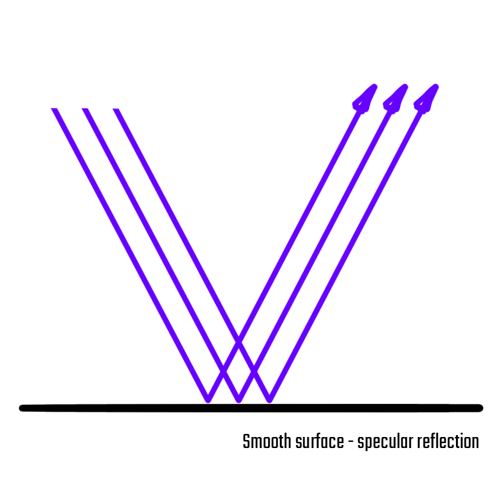
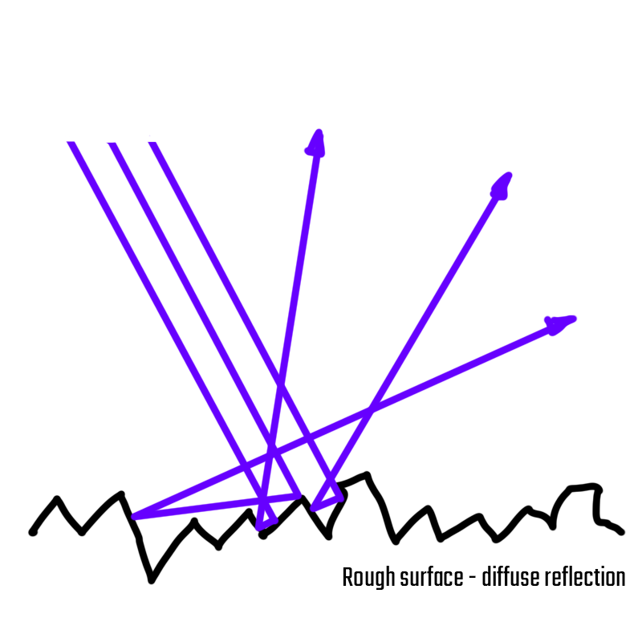

########
Lighting
########

Light is not just adding brightness and shadows to your render. It has to be used to support your composition, design and storytelling in your image or film.
When lighting, you are designing with color, shape and form - this means it is crucial to keep the gestalt principles as well as your composition in mind. 
Lighting is getting a lot more complex when you light for a moving image, but it also offers a bunch of 'cheats'.

This section aims to provide a short overview of the ideas you should keep in mind when lighting your shots.

*******************************
What is light ( for designers )
*******************************

There is a lot of interesting things in the physical qualities of light. As designers however, we mostly care about how it works in our scenes and how it makes things look. Most important to this look is how light in your image interacts with the shapes and objects in your scene, how it gets absorbed, reflected or refracted.

Absorption
==========

Wavelengths of light get 'eaten' by a surface. It gets converted into heat and can't be seen anymore. In white light, light that containts all wavelenghts visible to the human eye, an object has the albedo color of the wavelenghts that did not get absorbed. If a lightsource only sends out wavelengths that get absorbed by your object, it will seem black.

Reflection
==========

Light will get reflected on your surface. This means a ray that hits the surface will leave it in an equal and opposite angle. 
A smooth surface will reflect in a specular way, keeping parallel light rays when reflecting - this is called *specular reflection*. Lights reflect as a 'hard' specular reflection.

On a rough surface, the lightrays will get reflected in a lot of different directions. They lose their relationship to each other and the reflection seems blurred or completely lost. This is called *diffuse reflection*. Lights will reflect 'blurry'.

.. note::
    While scientifically inaccurate, we can think the same way of shadows: Parallel rays will create a 'hard' shadows while rays coming from multiple directions will create a 'softer' shadow.

Refraction
==========

Refraction describes how light can move through surfaces. Depending on the refractive index, the light will change direction when moving from one kind of matter into a different one. This can be seen in all transparent materials. Getting the refractive index right is incredibly important to make your cg material feel 'real'. Refrective indices are measured, physical properties of matter - you can find a huge list of different materials and their IORs here: `P&P IOR List <https://pixelandpoly.com/ior.html>`__.

Just like reflection, there are different types of refraction depending on the material properties of an object:

* If light rays stay parallel when they are refraced, the material seems 'transparent' and while refraction might bend the object behind a transparent material, we get a clear picture of the object.

* If light rays get refracted in all directions, we only see a blurry picture of anything behind the material. The material looks 'translucent'.

.. note::
    * On real materials, refraction will never occur by itself. There will always be a part of the light that gets reflected.
    * Air / Atmosphere is a mix of different materials that CG simplifies into 'volumes'.

Color and Color Temperature
===========================

When we speak of real world lights, we will most likely be referring to a physical property called *blackbody radiation*. This occurs when a material gets heated until it starts to radiate the heat energy as light.
When objects get heated, they emit a different mix of wavelength at different temperatures. 
Colder temperatures ( around 1800K ) emit mostly more red / yellow colors or 'warm' light. The hotter a object gets, the more blue colores will be emitted. The light will look white ( 5500K ) or even blue ( 16000K ). As the blackbody gets hotter, the light that gets emitted has 'cold' color.

.. figure:: https://upload.wikimedia.org/wikipedia/commons/thumb/e/e9/Color_temperature_black_body_800-12200K.svg/1920px-Color_temperature_black_body_800-12200K.svg.png

    Temperature and emitted color of light - Source: Wikipedia

.. note::
    This excludes special light emitters such as LEDs that emit light by using semiconductors to push electrons to a higher energy state. When they fall back down to a lower state, the LED will emit light of a *very specific wavelength* - This means that, different to blackbodies, LEDs can directly 'create' colored light.

For design, this means that a lit objects color will not only change their value, but also that saturation and hue. For example, a flame's hotter part will seem white or even blue while the colder parts seem orange or red. The same principle applies to reflected light.

.. figure:: https://images.freeimages.com/images/large-previews/a41/burning-candle-2-1477047.jpg

    Burning candle with flame emitting different colors at different temperatures.

*******************
Lighting Principles
*******************

Using light as a design and as a compositional element means that there are some overall ideas we should keep in mind when adding lights to our scene. You will find that many of these cross over with the `Gestalt Principles <Design/L4_GestaltPrinciples>`__ as well as color theory.

If you are not able to change the color, size or shape of objects in your frame, composition and lighting are the key to a satisfying image.

I will be using the principles by Chris Brehon in his `Cinematic Lighting Blog <https://chrisbrejon.com/cg-cinematography/chapter-6-lighting-principles/>`__ which helped me a lot for my own lighting knowledge by giving names to the 'things' we look for when lighting.
To find out more about these principles as well as a bunch of amazing examples, I can only recommend to read `his blog/book <https://chrisbrejon.com/cg-cinematography/>`_

Contrast
========
.. eye gets drawn to the point with the most contrast - use this
.. light contrast stronger than color
.. values!

Negative Space
==============

Silhouette
==========

Vignetting
==========

******************
Cinematic Lighting
******************

How light works in the frame
============================

Light and the Figure-Ground Relationship
----------------------------------------

Counterchange
-------------

Balance
-------

Further watching and reading:
    * Articles:
    * Videos:
        * `FZD on cinematic lighting <https://www.youtube.com/watch?v=om6uEktFodA>`_

.. _lightSetups:

******************
Basic Light Setups
******************

Light Categories
================

Sun / Moon
----------
.. main direction
.. use gobo ( goes before optics ) to mimic clouds

Sky
---
.. blue scattered light
.. overcast might be directionless and losing shapes - add interest with flags
.. clouds!!

Naturalist Light
----------------
.. basically using LOTS of lights to fake how a scene would be lit by the sky and sun only to save on rendertime and ressources

Practical Lights
----------------

Dramatic Lights
---------------

.. _keyFillKicker:

Key - Fill - Kicker - The Basic Ideas
=====================================

Key
---

Fill
----

Kicker
------

'Standard' Light Setups
=======================

.. Basic setups, but please be creative and figure out nice lighting yourself.

.. https://www.photovideoedu.com/Learn/Articles/the-five-basic-portrait-lighting-setups.aspx

Three Point Lighting
--------------------

Rembrand Light
--------------

Split Light
-----------

*************
Colored Light
*************

Light Temperatures
==================

Light Colors
============

**********************
Mixing color and light
**********************

.. Don't mix colors on one side

Percieved color
===============

Percieved value
===============
