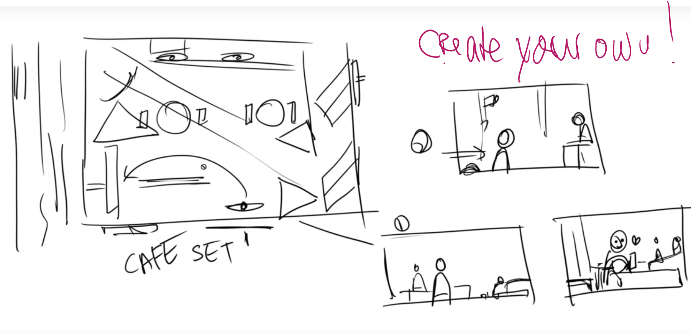

#####################################
Cameras, Blocking and your Storyboard
#####################################

***********************
What storyboards can do
***********************

The Frame
=========
Frame border, 2d

The Camera
==========
Focal length, depth of field, camera placement, camera grounding

.. Directing the eye
.. =================

.. Visual Flow & Focal Queue
.. -------------------------
.. Lines, perspective, object size. -> Uses Law of Continuity in a frame to direct the eye and tell a story

.. Singleframe - Multiframe
.. ------------------------