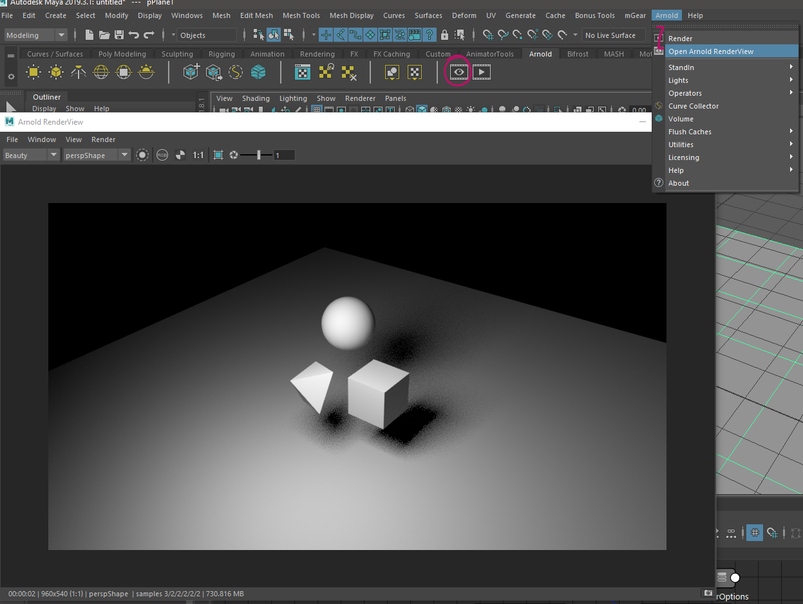
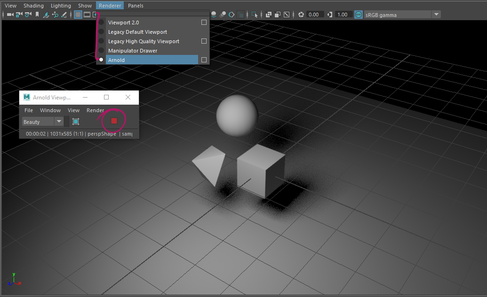
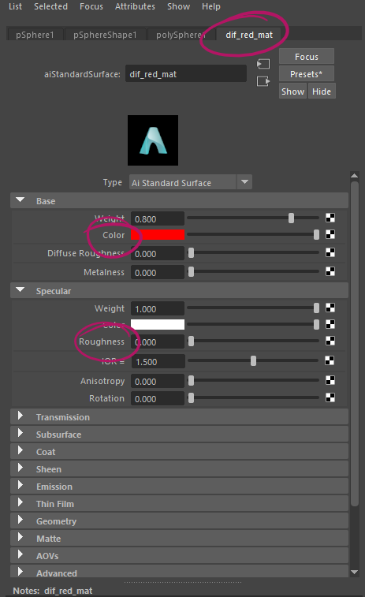
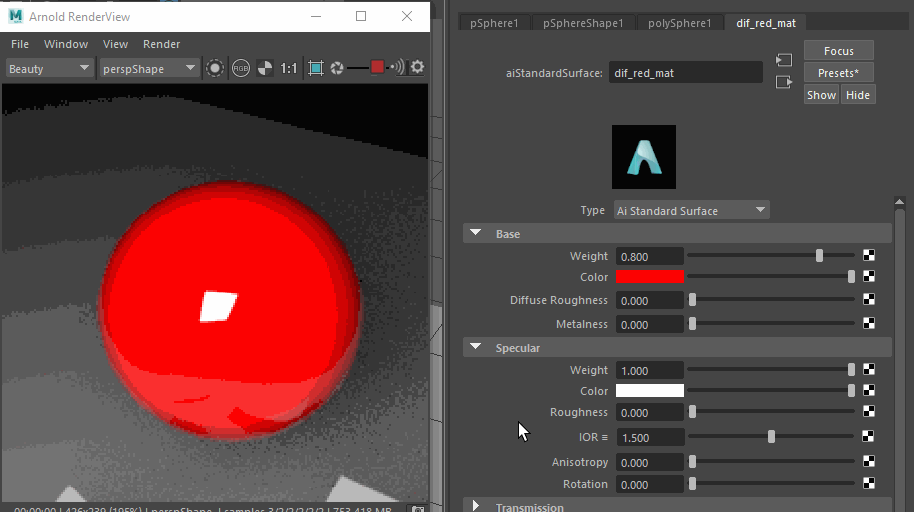
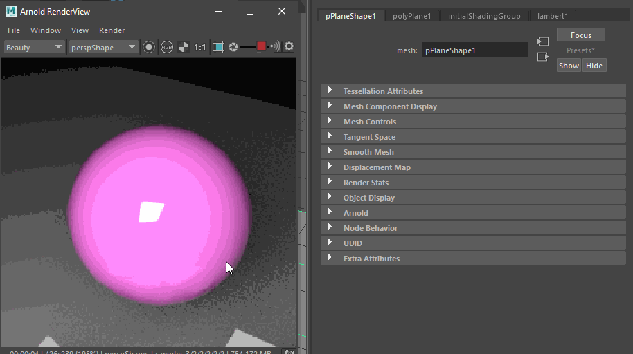
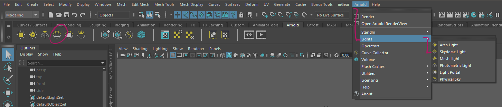
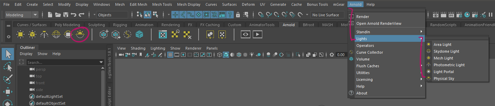
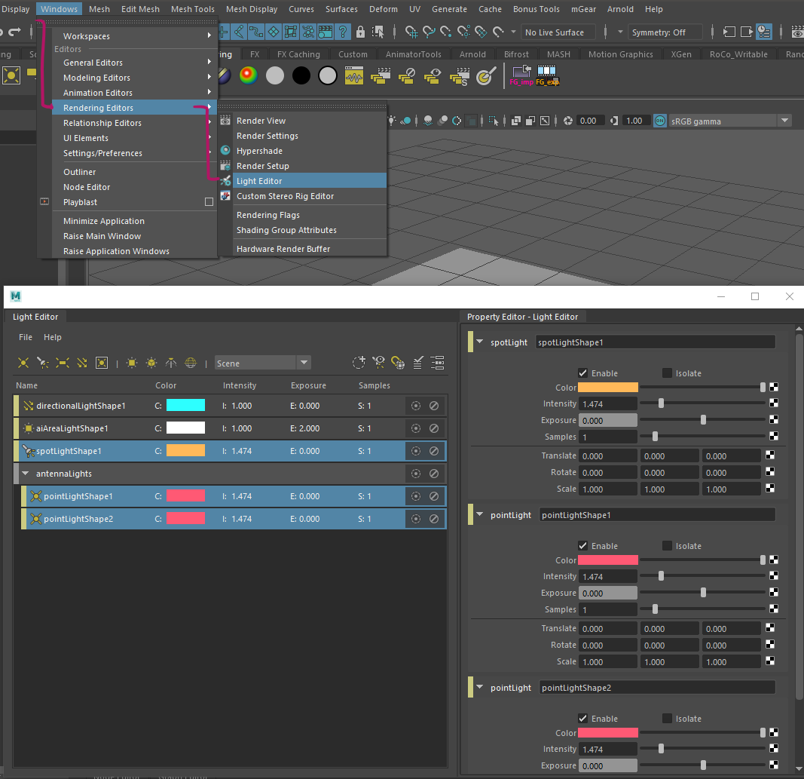

################################
Assignment 1 - Future City Scene
################################

.. image:: ./images/primitiveCity_comp_v001.png

**********
Assignment
**********

The goal of this exercise is to create a futuristic or cyberpunky city block made of 
primitive objects only. You will also have to assign basic materials and light the
scene.

************
Deliverables
************

* Render 1080 x 1080 PNG-File ( Arnold or Render-Engine of your choice )
* .ma-file

.. warning::
    | Make sure to name all files using the following naming convention:
    | *lesson1_firstname_lastname.ext ( where .ext is the file extension )*

***************
Links and Tipps
***************

* Make sure to set up a correct Maya Workspace, see :ref:`workspaceSetup`.
* You can find out all about the tools needed to create the geometry for 
  this assignment in the :ref:`workingWithPrimitives` section.
* Think about the scene first. Create the big forms first and add detail later.
* The :ref:`bigMediumSmall` and :ref:`80_20rule` design rules will help you a 
  lot when composing the scene.
* You can always use reference or other ways of growing your :ref:`visualLibrary`,
  just don't lift ideas directly from this assignment's example scene. 

*******************
Rendering the scene
*******************
This assignment will have you rendering your very first image. We will use Maya's integrated
render engine, 'Arnold'. Arnold is a biased renderer with a CPU and a GPU version. While faster,
the GPU version does not support all of Arnold's features yet. I will be working with the CPU
engine, but you are free to use the GPU version if your workstation supports it.

.. hint::
    Before working with the renderer, make sure it is loaded by going to **Windows -> Settings / Preferences -> Plug-in Manager**.
    Find the entry called **mtoa** and make sure the 'loaded' checkmark is set.

    .. image:: ./images/arnoldLoaded.png

Launching the Immediate Preview Renderer ( IPR )
================================================
When setting up your render you will most certainly want to see what you are creating. 

The best way to preview your render is to open Arnolds render view.
Open the Arnold Render Preview Window by clicking the corresponding button on the Arnold shelf or
by going to **Arnold -> Open Arnold RenderView**. Click the 'Play' button to transfer the active
viewport to arnold and start rendering. The render view lets you set the camera used for rendering,
choose a preview resolution ( good for slower systems or screens with a high pixel count ) as well
as check different channels, set the exposure of the image, region rendering and comparing different
versions of the image.

Find out more about the render view in the Arnold User Manual:
    `Render View <https://docs.arnoldrenderer.com/display/A5AFMUG/Arnold+RenderView+Window>`_

You can also launch the Arnold IPR as a panels renderer by setting it as a panel's render engine. 
A small window will open. 
Click the Play / Stop button to launch your render.

.. note::
    If your render turns out black when launching the IPR, you most likely did not add any lights to the
    scene or your lights have a really small exposure and intensity setting.
    If you are only setting up materials, you can just create a basic `<Skylight / Physical Sky>`__ to get
    started.

********************
Materials and Colors
********************

To use different colors on your objects, you will need to assign materials and shaders
to your scene. This section will explain in a really basic way how to set up and 
assign the materials for this assignment. It is by no means exhaustive and we won't be
covering how to create a realistic looking material or what each of the settings and
parameters of a material do.

Creating a basic material
=========================
An object's color in a 3D scene is defined by the shader that is assigned to the 3D mesh.
While shaders can come in many different forms, we will be using surface shaders called 
'Materials'. Arnold gives us a choice of many different material types, but we want to focus
on the often used and very versatile `Standard Surface <https://docs.arnoldrenderer.com/display/A5AFMUG/Standard+Surface>`__.
The standard surface is a pysically based PBR shader capable of producing many different 
types of materials by mixing different property layers. We will be focusing on its *Diffuse* Layer.

Assigning a material
====================
You can create materials in different ways.

The fastest way is by using the right-click hotbox:

To create a new material:

    .. image:: ./images/assignNewStandardSurface.png

    1. Right-click the object you want to assign a material to.
    2. Choose 'Assign New Material...'
    3. The window for creating new nodes appears.
    4. Click 'Shader' below the 'Arnold' heading to show Arnold shaders only
    5. Choose 'aiStandardSurface' to create a Standard Surface shader.
    6. Set the settings of the material in the attribute editor.
    7. Make sure to rename the material to something you can remember easily.

To assign an existing material:

    .. image:: ./images/assignExistingMaterial.png
    
    1. Right-click the object you want to assign a material to.
    2. Choose 'Assign Existing Material...'
    3. Choose the material from the list.

You can also create and assign materials using the `Hypershade Window <https://help.autodesk.com/view/MAYAUL/2020/ENU/?guid=GUID-252707EC-4AAF-4D3F-9600-804F783652B7>`__.
This is a little slower than the hotbox but it will allow you to edit and set up complex material setups.
We will be covering this topic a little later in our course.

Changing a material's settings
==============================

To adjust a materials settings, find the material node in the attribute editor:

Click the object and find the tab in the atribut editor that has the material's name. Alternatively, you can find 
the material in the Hypershade's Material Catalog and click it there.

The two main settings we want to look at are 'Diffuse'/'Color' and 'Specular'/'Roughness':

'Diffuse'/'Color' defines the main color of the material:

'Specular'/'Roughness' changes the simulated Roughness of the material. A value of 0 means the object
will be completely specular and reflective, mostly plastic like. A value of 1 makes the material a 
completely diffuse material with very little reflections. To create a metal like material, there is 
another parameter called 'Metalness' this should either be zero or one (There are no 'Half-Metals' occuring
in nature). We will cover material creating later in this course. It would be best to keep to fully diffuse
materials for now.

Base settings of a Standard Surface in the Arnold Manual:
    `Base <https://docs.arnoldrenderer.com/display/A5AFMUG/Base>`__

Making a glowing material
=========================
Our city scene will features glowing neon boards and windows. Glowing materials are a special kind of material
called 'Emissive'. Emissive materials can be opening the 'Emissive' Rollout of the Arnold Standard Surface and 
driving up the weight of the emission. You can set a color by choosing a 'Color' in the Emissive rollout.

.. image:: ./images/arnold_ChangeEmission.gif

.. note::
    Emissive materials in Arnold will create light just like a light would. They will light up objects around
    them.

Emission in the Arnold Manual:
    `Emission <https://docs.arnoldrenderer.com/display/A5AFMUG/Emission>`__

***********************
Lighting the assignment
***********************

This will be a very short look into lighting with Maya lights and Arnold. This section
is by no means exhaustive, lighting technique and principles are complex and will be 
covered in depth later in this course. 
This section will be an overview and give you the tools to creatively and beautifully 
light this assignment.

There are a lot of different light types in Maya and all of them are supported by Arnold.
This guide will contain a lot of links to the 
`Arnold User Manual <https://docs.arnoldrenderer.com/display/A5AFMUG/Arnold+for+Maya+User+Guide>`__
where you can find out more about each light's settings.

Skylight / Physical Sky
=======================
The `Arnold Skydome Light <https://docs.arnoldrenderer.com/display/A5AFMUG/Ai+Skydome+Light>`__ 
simulates light from an infinite sphere around the scene. You can use this with a flat color, 
HDRI light enviroments or the `Physical Sky <https://docs.arnoldrenderer.com/display/A5AFMUG/Physical+Sky>`__
that simulates how a real sky would light your scene.

You can create a Skydome light by going to **Arnold -> Lights -> Skydome Light**. This will create 
a white skydome. You can adjust brightness and colors in the attribute editor.

To create a physical Sky, go to **Arnold -> Lights -> Pyhsical Sky**. This will create a physical
sky that lets you change the color and light direction by modifying sun height and position.

Lights
======
Arnold supports all Maya lights and provides its own `Area Light <https://docs.arnoldrenderer.com/display/A5AFMUG/Ai+Area+Light>`__.
Arnold lights can be created from the **Arnold -> Lights** Menu. 
Maya lights can be created by using the light buttons on the *Rendering* shelf or from the **Create -> Lights** Menu.

You are free to choose from all lights available in Maya to light your scene. 

Check out the Arnold Manual for more  Information on the different light types:

Arnold User Manual Links:
    `Lights <https://docs.arnoldrenderer.com/display/A5AFMUG/Lights>`__
    `Area Lights <https://docs.arnoldrenderer.com/display/A5AFMUG/Ai+Area+Light>`__
    `Point Light <https://docs.arnoldrenderer.com/display/A5AFMUG/Point+Light>`__
    `Spot Light <https://docs.arnoldrenderer.com/display/A5AFMUG/Spot+Light>`__
    `Directional Light <https://docs.arnoldrenderer.com/display/A5AFMUG/Spot+Light>`__

.. hint::
    Arnold's default settings for lights can be quite dark. You can use a lights exposure or intensity 
    parameter to increase the light's strength.

.. note::
    Lights in Arnold have two values to control the lights power, *Intensity* and *Exposure*.
    The only difference here is that *exposure* works like a real light would work: Increasing 
    the power value by one will output double the amount of light.
    *Intensity* will increase the output in a linear fashion.

The Light Editor
================

You might want to edit a bunch of lights at once. The Attribute Editor won't allow you to do this. For
easy access to all lights in the scene, you can use the `Light Editor Window <https://help.autodesk.com/view/MAYAUL/2020/ENU/?guid=GUID-72B6C563-E93A-4A03-8F9B-8168FB8E3C52>`__.
This editor also lets you organize, group and manage all the lights in your scene.

.. note::
    All lights have powerful settings and parameters that can make or break your scene. Check the
    documentation linked above for examples and play around with the settings for a good image.
    Try different light directions and look at the shadows that get created by your sky's light direction.
    
    For my image I used a small exposure on the skylight with a blue color and lit the scene by using 
    glowing materials and distinctly places arealights.

*********
Rendering
*********
We will be using Maya's integrated render engine 'Arnold' to render the final images.
As with lighting, this section is by no means exhaustive but will give you a quick step
by step way to set up the render correctly. 
Final rendering can take quite some time, so plan at least 10 minutes for the final
image render.

.. hint:: 
    If you do not want to use Arnold, you are invited to use any render engine of
    your choice. Please note that this is your own resposibility and I won't be able
    to support all render engines.
