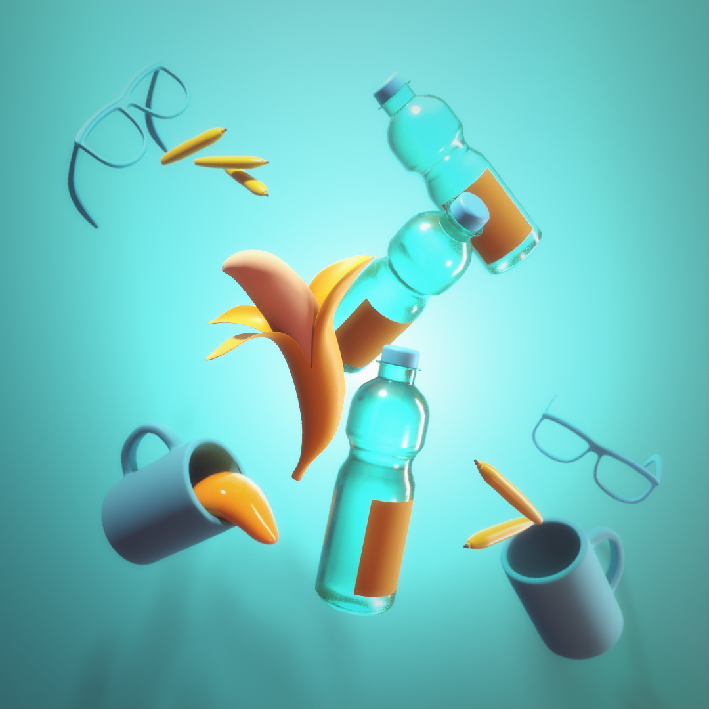

###############################
Assignment 2 - Floating Objects
###############################

**********
Assignment
**********

For this lesson we will create a compsition of multiple simple floating objects.
You will be using all tools found in :ref:`Basic Modeling Tools <basicModelingTools>`. You can use any object
found on your desk or in your living spaces as a reference.
Use a single color for the objects and different color for the background to keep theory
scene as simple as possible.

This assignment is inspired by the the photography by Carl Kleiner's `Everything can fly <https://tags.myblog.arts.ac.uk/2017/02/03/carl-kleiner-anything-can-fly/>`__
photoseries and the `Balancing <https://500px.com/p/arken?view=photos>`__ photoseries by Dina Belenko.

.. tip::
    If you just moved in and there are no objects floating around your living space try the
    `Random Object Generator <https://www.bestrandoms.com/random-item-generator>`__ for 
    inspiration.

************
Deliverables
************

* Models of at least 6 different objects.
* At least 5 compostition sketches. ( Pencil or Digital drawing )
* Render 1080 x 1080 PNG-File ( Arnold or Render-Engine of your choice )
* .ma-file

.. warning::
    | Make sure to name all files using the following naming convention:
    | *lesson2_render_firstname_lastname.ext ( where .ext is the file extension )*
    | *lesson2_composition_firstname_lastname.ma ( where .ext is the file extension )*
    | *lesson2_objectName_firstname_lastname.ext ( where .ext is the file extension )*
    | *lesson2_sketches_firstname_lastname.ext ( where .ext is the file extension )*

***************
Links and Tipps
***************

* Make sure to set up a correct Maya Workspace, see :ref:`workspaceSetup`.
* You can find out all about the tools needed to create the geometry for 
  this assignment in the :ref:`Basic Modeling Tools <basicModelingTools>` section.
* Try simple objects made of mostly primitive forms first and increase complexity as you
  grow more comfortable using the different modeling tools and commands.
* Look into image composition rules and try different compositions before deciding 
  on a final image. Check out :ref:`shapeAndSilhouette` and ::ref:`grouping`.
* Try not to overcomplicate the final models. This excersize aims to learn the tools and
  not for photo realistic modelling.
* You can adjust an objects roughness and specular value to differentiat between different
  materials without changing an objects color.
* Try different light setups. You can find more into in :ref:`lightSetups` and 
  :ref:`keyFillKicker`
* Try if colored lights can make for a more interesting final image.