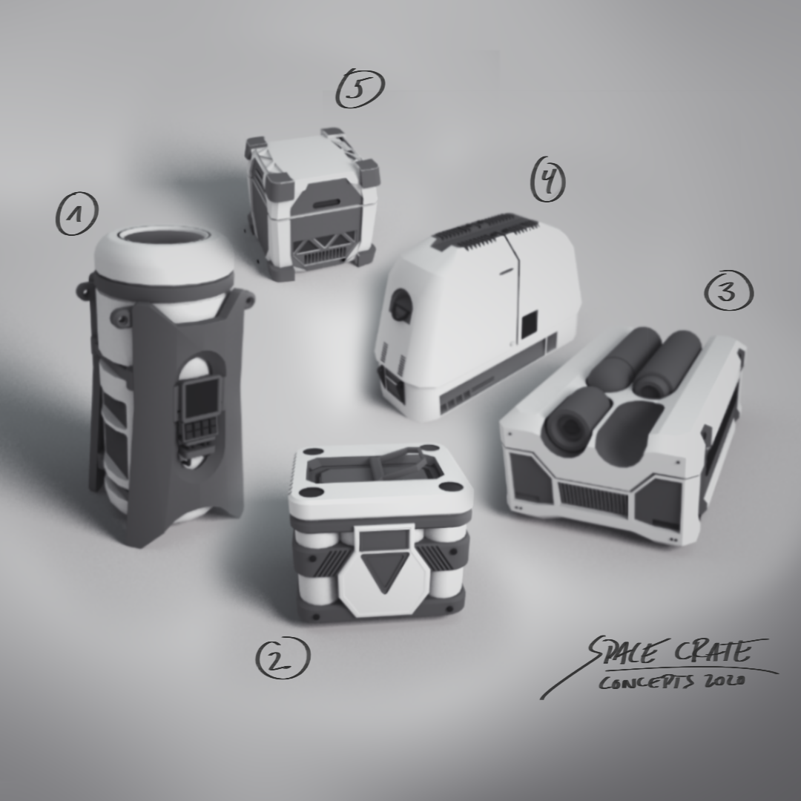

####################################
Assignment 3 - Sci-fi Crate Concepts
####################################

**********
Assignment
**********

For this Lesson, we will use the Gestalt Design Principles and the tools of Big - Medium - Small and 70-30 to create 3D concept art for SciFi crates.

You will create five different crates using the Basic Modeling Tools and the new Constructive Solid Geometry workflow ( also called Boolean ). You can  employ the helo of tools like DCBoolManager and Shapecutter to create interactive boolesans. Aim to create five distict and different designs.

Create three differently colored materials. Apply one of them to all 'Big' shapes, one of them to the 'Medium' shapes and one of them to the 'Small' shapes. You can apply them to a polygon selection if there are multiple shapes in one single object.

Use a renderengine to render one single png per crate and use an image editor to create one overview image / presentation with those renders.

************
Deliverables
************

* One archive file ( .zip or .rar ) with:
  * One Mayafile with least 5 different crates
  * Five raw renders 1080 x 1080 - one of each crate
  * One overview image to present all crates created from the raw renders
  * Ideation sketches ( scan / photo / digital )

.. warning::
    | Make sure to name all files using the following naming convention:
    | *lesson3_render_xxx_firstname_lastname.ext ( where .ext is the file extension and xxx is a number)*
    | *lesson3_presentation_firstname_lastname.ext ( where .ext is the file extension )*
    | *lesson3_sketches_firstname_lastname.ext ( where .ext is the file extension )*
    | *lesson3_scene_firstname_lastname.ext ( where .ext is the file extension )*

***************
Links and Tipps
***************

* Make sure to set up a correct Maya Workspace, see :ref:`workspaceSetup`.
* Start from different primitives and shape them using the basic modeling tools before adding details and changing the shape using booleans.
* Use the Big-Medium-Small and 70-30 rules to create appealing looking shapes in your models
* Remember that the Gestalt Principles also apply to shapes in 3D space.
* Don't overcomplicate the light setup and remember that the aim of this excersize is the design of applealing shapes and cool designs in 3D.
* Don't lock yourself in a design direction to quickly. Use the interactivity of the boolean workflow to play with shapes and build an understanding of design.
