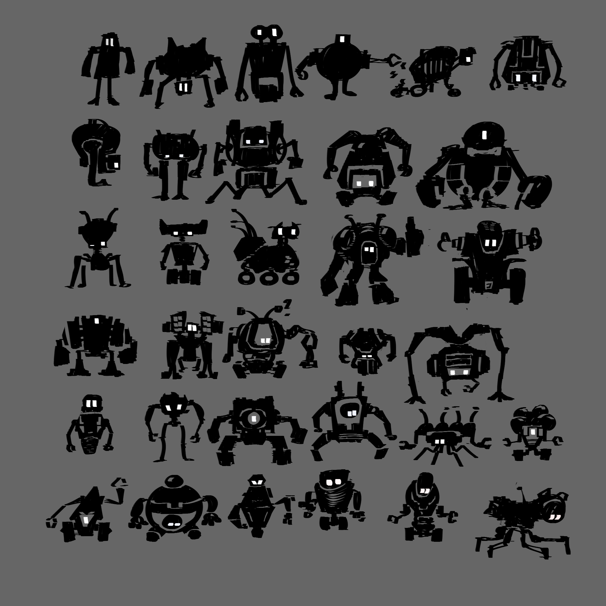
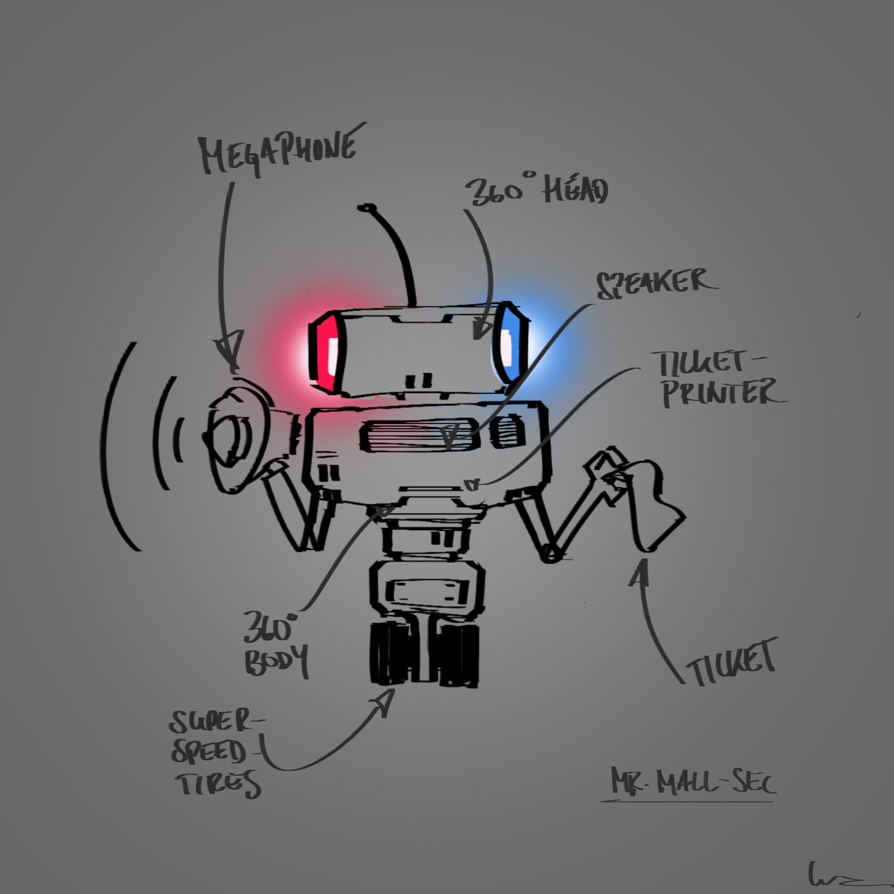
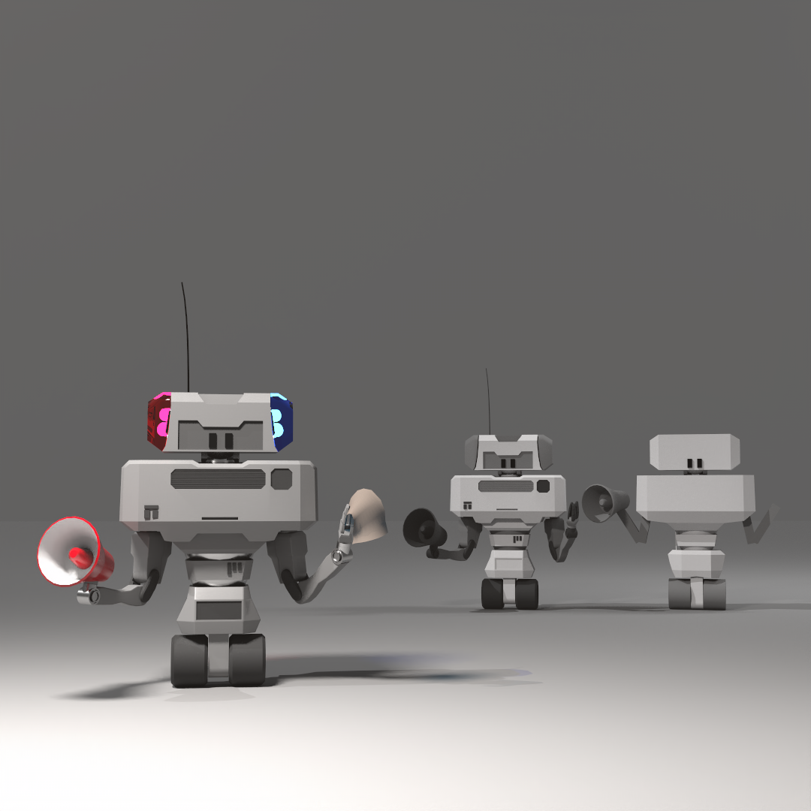

############################
Assignment 4 - Robot Concept
############################

.. https://www.blue-zoo.co.uk/animation/cozmo

**********
Assignment
**********

Concept an build a robot.

************
Deliverables
************

* Render 1080 x 1080 PNG-File ( Arnold or Render-Engine of your choice )
* .ma-file

.. warning::
    | Make sure to name all files using the following naming convention:
    | *lesson2_render_firstname_lastname.ext ( where .ext is the file extension )*
    | *lesson2_composition_firstname_lastname.ma ( where .ext is the file extension )*
    | *lesson2_sketches_firstname_lastname.ext ( where .ext is the file extension )*

***************
Links and Tipps
***************

* Make sure to set up a correct Maya Workspace, see :ref:`workspaceSetup`.