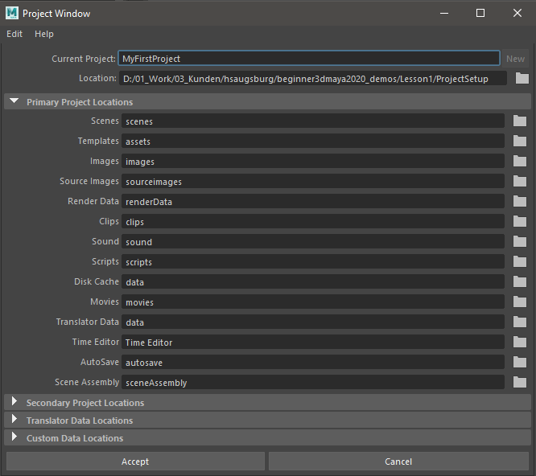

##########
Workspaces
##########

***************
Workspace Setup
***************

What is a workspace?
====================
Maya uses workspaces to organice projects into folder structures. It will create a bunch of folders for assets,
textures, playblasts, autosaves and more on a per-need basis.

.. warning:: 
    | **Maya might create a bunch of clutter in your user-folder if you don't set your projects correctly.**
    | **When working on a new project, make sure you always set-up or change the workspace to make sure you are not cluttering your old projects.**

.. _workspaceSetup:

Setting up a workspace
======================

1. Go to File -> Project Window
2. Click on the folder icon behind 'Location'
3. Choose the location for your project, select "Select"
4. Insert the project's name in 'Current Project'
5. Click 'Accept'
6. The new project has been created and been set as the current project

.. note::
    | You can further customize how your project is set up by changing the paths in the list below. All paths are relative to the project root.
    | You can delete the paths in the lines you don't need to prevent Maya from creating these folder.

If you want to learn more about how Maya organizes files check out the official 
`Maya Documentation <https://help.autodesk.com/view/MAYAUL/2020/ENU/?guid=GUID-9CE78B5A-7E9F-45E6-AB6D-66795E5656F4>`__

Switching workspaces
====================
You can also switch to an existing workspace. A workspace always has a ``workspace.mel`` file.

1. Go to File -> Set Project
2. Choose the folder that contains your project
3. Click "Set"
4. If there is no project set up in this folder, Maya will ask you if you want to create a default one.

Editing a workspace
===================
Workspaces are defined by a human readable ``workspace.mel`` file. This file contains all information and paths related
to your project. It can be opened by any text editor, for example notepad++. If you want to change a path, this can be
done by exchanging the path in this file. Note that Maya won't copy your old files over, but will save all newly created
files in the new location.