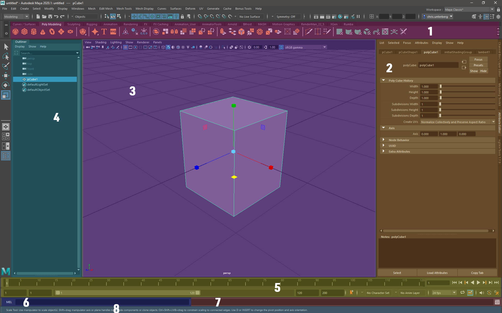
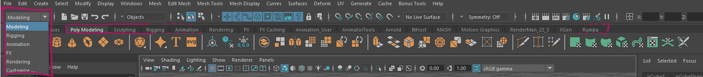
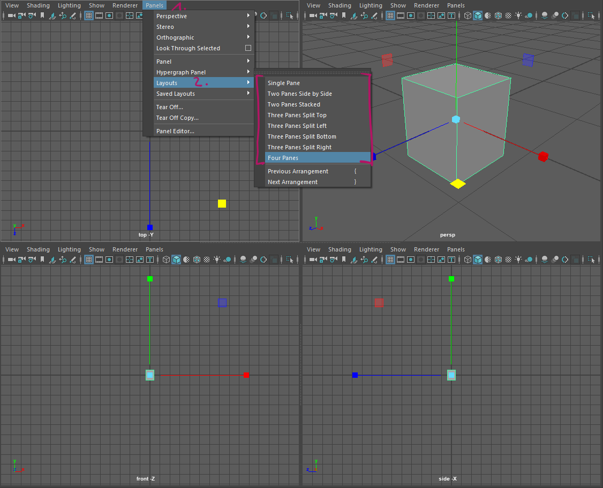
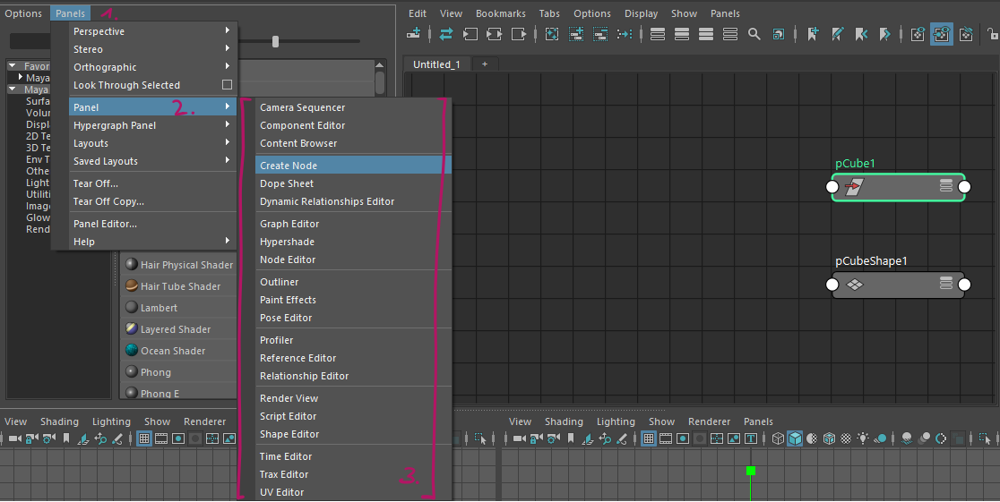
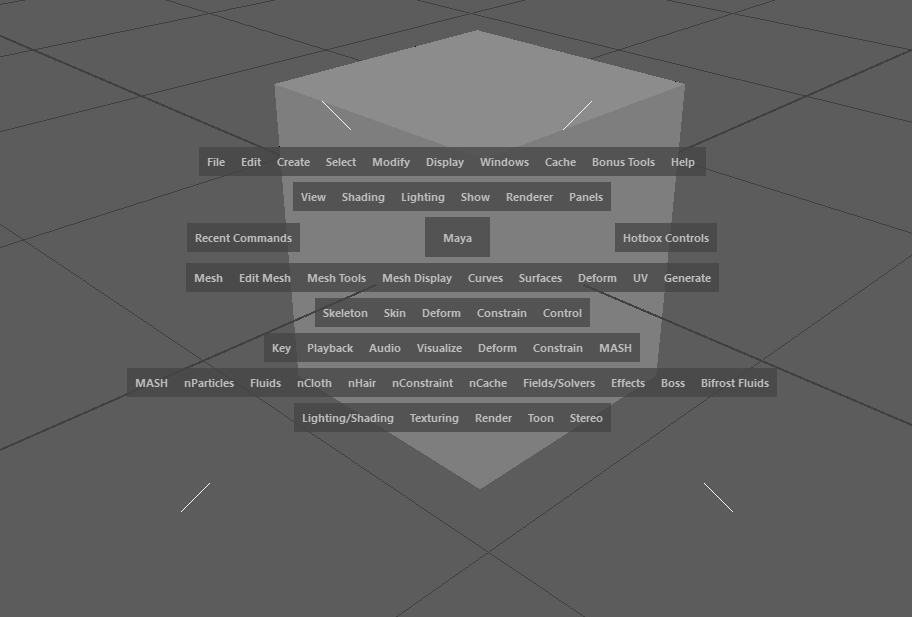
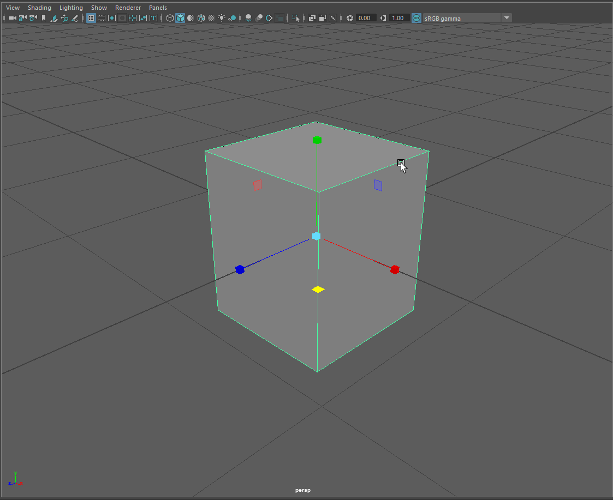

##################
Interface Overview
##################

*********
Interface
*********

Maya's interface can be daunting when opened for the first time. We want to have a closer look at the GUI and learn how
different tasks are sorted intro different workspaces in this lesson. We will also have a look at the most important
hotkeys and viewport navigation.

Overview
========

======== ============================== ========================================================================
Number   Name                           Usage
======== ============================== ========================================================================
1        Shelves                        Quick access to many functions and scripts via icons sorted by tasks
2        Attribute Editor / Channelbox  Main editors for values and variables of selected objects and nodes
3        Viewport                       Main interaction window with the 3D scene and world
4        Outliner                       Quick access and manipulation of the scene hierarchy
5        Timeline Area                  Scrub time, play animayion, access to animation settings
6        Console                        Insert mel or python commands and call them
7        Script output                  Outputs messages, warnings and errors from script editor
8        Status lines                   Outputs messages about mayas status and tooltips
======== ============================== ========================================================================

Shelves and Workspaces
======================

Maya's tools are sorted into shelves and workspaces. Menus in the menu bar will appear and disappear based on the
workspace selected. There are 5 main workspaces accessed by the dropdown in the top left corner:

* Modeling
* Rigging
* Animation
* FX
* Rendering

These workspaces correspond to tasks in the 3d pipeline and will show all tools needed for these tasks.

Shelves are customizable icon bars. You can use these bars to quickly call different Maya commands. Shelves are sorted
by tool sets and tasks and you will most likely create your own shelves while working with Maya.

.. note::
    | You can easily add a tool from the menu to the shelf by ctrl+shift+middle-clicking any menu item.
    | You can also select text in the script editor and middle-drag it to a shelf to create a button for the script.

.. warning::
    | Make sure to save your shelves by clicking the small gear wheel to the left of the shelf and choosing "Save All Shelves"

Find out more about the power of shelves in the official 
`Maya Documentation <https://help.autodesk.com/view/MAYAUL/2020/ENU/?guid=GUID-4A21F741-C9AC-4AE5-897E-B6F8C68ADF90>`__

.. note::
    You can find a lot more information about the interface, including menu sets that are not covered in this quick
    start in the official `Autodesk Maya Manual <https://help.autodesk.com/view/MAYAUL/2020/ENU/?guid=GUID-F4FCE554-1FA5-447A-8835-63EB43D2690B>`_

Viewport Navigation Hotkeys
===========================
You will mainly use hotkeys to navigate the viewport. If you learn these by heart, interacting with the 3D viewport will
become natural very quickly.

================== ====================================================
Hotkey             Action
================== ====================================================
F                  Move to selection and make it the new view center
Space              Open hotbox / toggle viewport layout
Shift + Rightdrag  Zoom camera towards view center
Alt + Leftdrag     Rotate camera around view center
Alt + Middledrag   Pan camera
================== ====================================================

Panel Setup
===========
Maya's viewport is made up of up to four panels. It supports different panel layouts and allows any editor content in
these panels. You will that you like different layouts for different tasks or discover a favourite layout. Starting out,
it makes the most sense to try different layouts for different tasks until you find one that fits your style of working
best.

Switch the layout either via the `hotbox`_. or by going to Panels -> Layouts -> [YOUR LAYOUT] in the small menu bar over
the editor pane.

You can switch the content of each pane in the small menu bar over the editor pane by going to Panels -> Panel -> [YOUR
PANEL CONTENT]

Hotbox
======

Open the hotbox by pressing and holding down **Space** over the viewport. Mayas hotbox is a quicker way of accessing all
menus in the menu bar.

Tap spacebar to toggle between your panel setup and a maximised viewport.

You can click the middle-area of the hotbox while holding down space to switch the contents / camera of the panel under
the cursor.

.. note::
    | You do not have to wait for the menu to appear to switch the contents. You can just flick the mouse into the direction of your target to switch the panel.

*******************
Main Editor Windows
*******************
The official Autodesk Maya Documentation is very thorough explaining the main editor windows. You can refer to their
manual pages for more information.

* `Editor / Viewport <https://help.autodesk.com/view/MAYAUL/2020/ENU/?guid=GUID-455539A6-3506-458C-92DA-14F171C14553>`_
* `Outliner <https://help.autodesk.com/view/MAYAUL/2020/ENU/?guid=GUID-4B9A9A3A-83C5-445A-95D5-64104BC47406>`_
* `Channelbox <https://help.autodesk.com/view/MAYAUL/2020/ENU/?guid=GUID-4C954FB2-8B6A-4BBD-9695-DF432616D0D2>`_
* `Attribute Editor <https://help.autodesk.com/view/MAYAUL/2020/ENU/?guid=GUID-67A58D31-4722-4769-B3E6-1A35B5B53BED>`_

