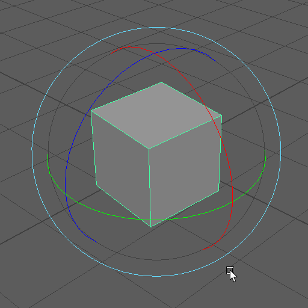
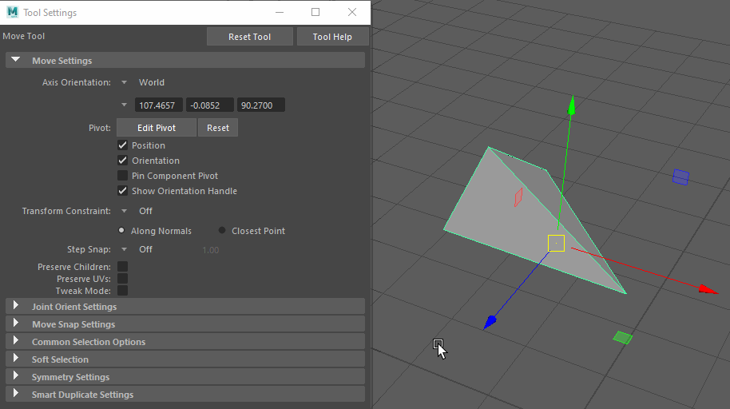

#######################
Working With Primitives
#######################

The easiest way to create 3D objects are primitives. Primitives are mathematically defined, parametrical objects like
cubes, spheres, pyramids etc. 

******************
Primitives in Maya
******************

Creating Primitives
===================
There are 3 ways of creating primitives in Maya:

1. The 'Modeling' shelf:
    .. image:: ./images/polyModelingShelfPrimitves.png
    
    1. Make sure the 'Modeling' shelf is visible. Most icons on this shelf are orange.
    2. Click one of the primitives on the left part of the shelf.

2. The main menu bar:
    .. image:: ./images/createPolyPrimitive.png
    
    1. In the 'Modeling' workspace, go to Create -> Polygon Primitives
    2. Choose one of the many available polygon primitives. You will find that there are many more Primitives available than there were in the 'Modeling' shelf.
    3. Maya will create the new primitives with default parameters at the world center.
    
    .. note::
        You can enable 'Interactive Creation' in this menu to edit the primitves dimesions while creating

3. The command line / script editor:
    .. image:: ./images/createPolyPrimitiveScript.png

    1. Open the script editor by clicking the script editor icon in the bottom right corner
    2. Click the '+' button to add a new script tab.
    3. In the dialog choose 'MEL' to create a mel-script
    4. Enter ```polyCube -w 2 -h 2;``` to create a cube  of width (-w) and height (-h) of 2
    
    .. hint::
        | You can also run this code by entering it in the commandline:
        | 5. Make sure the commandline mode is set to 'MEL'
        | 6. Enter the code in the commandline and press Enter.

.. note::
    | After creating the primitives, you can press 'T' to open a floating window to edit the main parameters of the object. 

Editing Primitives
==================
You can change a primitives parameters in the Attribute Editor or the Channelbox.
A primitive in Maya consists of three different nodes ( we will learn about nodes later ). The primitive's node is
always called the same as their command. In case of **polygon primitives**, find the node prefixed by **'poly'**, for
example **'polyCube1'**. 

.. warning::
    Maya does not allow to have any nodes with duplicate names in one scene. It will always increase the suffixed number
    when creating nodes of the same type. If you import or reference a file, you can use namespaces to get around this.

You can now edit a primitives parameters by typing values or by using the sliders. Advanced parameters will only be
exposed in the Attribute Editor.


.. note::
    Press 'T' after creating a primitive to call up a small floating dialog that lets you edit these parameters without
    finding the node

As always, you can learn more about primitives, their parameters and usage in the official Autodesk Maya Manual:

* `Primitive Types and Options <https://help.autodesk.com/view/MAYAUL/2020/ENU/?guid=GUID-45D2EAD4-5BCF-42DA-A1AB-EC6EE09FE705>`_
* `Primitive Creation via menu <https://help.autodesk.com/view/MAYAUL/2020/ENU/?guid=GUID-9819BE57-2C37-4D90-BC61-390C9C51BD79#GUID-9819BE57-2C37-4D90-BC61-390C9C51BD79>`_
* `Primitive creation via shelf <https://help.autodesk.com/view/MAYAUL/2020/ENU/?guid=GUID-C4F6724D-1887-41C5-ADB1-A32FEF47FDD3#GUID-C4F6724D-1887-41C5-ADB1-A32FEF47FDD3>`_
* `Interactive creation <https://help.autodesk.com/view/MAYAUL/2020/ENU/?guid=GUID-6D21314A-54AD-41D4-AFC0-AAED13CD50A6#GUID-6D21314A-54AD-41D4-AFC0-AAED13CD50A6>`_


*******************
Object Manipulation
*******************

Selecting Objects
=================
To manipulate objects in the viewport, you must select them first. Switch to the selection tool by pressing **Q**.
You can now marquee-select all objects in the viewport. If you want to remove objects, hold Ctrl while dragging or
clicking. Holding shift will toggle the selected objects, deselecting objects that are selected and selecting objects
that are unselected.

.. hint::
    If you want to mask certain object types from the selection, you can use the selection mask buttons on top of the shelf:

    .. image:: ./images/selectionFilter.png

.. note::
    | You can also select objects in the outliner. This lets you select objects that are not selectable in the viewport such as transforms, shape nodes and groups

As always, you can find out a lot more about selecting in the `Official Autodesk Maya Documentation <https://help.autodesk.com/view/MAYAUL/2020/ENU/?guid=GUID-730DA883-8B11-4A40-9573-0A54AA1D861F>`__

Object manipulation in the viewport
===================================
Most object manipulation in maya is done via the three main gizmos: Move, Scale and Rotate. To get rid of a manipulaiton
tool, switch to another tool, i.e. selection

================================ ================================= ================================= ================================= 
Move                             Scale                             Rotate                            Select
================================ ================================= ================================= =================================
|manip_move|                     |manip_scale|                     |manip_rotate|                    |manip_select|
Shortcut:                        Shortcut:                         Shortcut:                         Shortcut:
**W**                            **E**                             **R**                             **Q**
================================ ================================= ================================= =================================


.. note::
    | You can change the gizmos size by pressing **+** and **-**. This will also tweak the sensitivity of the gizmo.

    .. image:: ./images/resize_gizmo.gif


Working with the manipulation tool and gizmos
=============================================
You will use the manipulation tools and gizmos in Maya a lot! This section will explain their settings,
shortcuts and give you deeper understanding of the tools to make your work easier and faster.
Maya uses the middlemouse button heavily: It will let you interact with the tool without clicking an axis
or the gizmos center. This manipulation might feel strange at first, but after some time you will be much 
faster using this mode than precisely clicking the arrows.

Moving
------

+-----------------+-----------------------------------+---------------------------------------------------------------+
| Space           | Demo                              | Explanation                                                   |
+=================+===================================+===============================================================+
| Viewplane       | |move_viewplane|                  | | Clicking the middle of the object and dragging will move    |
|                 |                                   | | the object in the projected 2D view plane. This might sound |
|                 |                                   | | mathematical but don't worry. It just 'feels' correct.      |
|                 |                                   | | *Middlemouse-Drag will default to this mode.*               |
+-----------------+-----------------------------------+---------------------------------------------------------------+
| Axis Constrain  | |move_axis|                       | | You can click any axis of the gizmo and drag to move the    |
|                 |                                   | | object in only this direction. Maya will remember this      |
|                 |                                   | | direction and show you it is selected by coloring the arrow |
|                 |                                   | | yellow.                                                     |
|                 |                                   | | *Middlemouse-Draw now will only move the object in*         |
|                 |                                   | | *the selected direction.*                                   |
+-----------------+-----------------------------------+---------------------------------------------------------------+                                
| Plane Constrain | |move_plane|                      | | Clicking any of the rectangles between two arrows will let  |                                             
|                 |                                   | | you constrain the movement to this axis. You can also       |                                        
|                 |                                   | | constrain the movement to an axis by **ctrl-clicking**      |                                        
|                 |                                   | | the arrow perpendicular to the plane.                       |                        
|                 |                                   | | *Middlemouse-Drag will now be constrained to the last*      |                                        
|                 |                                   | | *selected plane.*                                           |
+-----------------+-----------------------------------+---------------------------------------------------------------+
       


Rotating
--------

+-----------------+-----------------------------------+---------------------------------------------------------------+
| Space           | Demo                              | Explanation                                                   |
+=================+===================================+===============================================================+
| Trackball       | |rotate_ball|                     | | Clicking the grey area of the rotate gizmo will give you a  |                                        
|                 |                                   | | trackball like rotation. This is the most natural           |                                        
|                 |                                   | | interaction with the rotate gizmo and will make almost any  |                                       
|                 |                                   | | rotation possible                                           |                        
+-----------------+-----------------------------------+---------------------------------------------------------------+
| Viewplane       | |rotate_viewplane|                | | Clicking the yellow circle of the gizmo and dragging will   |
|                 |                                   | | rotate the object around an axis projected straight into    |
|                 |                                   | | the viewing plane.                                          |
|                 |                                   | | *Middlemouse-Drag will work like selecting a rotate band.*  |
+-----------------+-----------------------------------+---------------------------------------------------------------+
| Axis Constrain  | |rotate_axis|                     | | You can click the rotate bands of the gizmo to only rotate  |
|                 |                                   | | the object around a single axis. Maya will remember this    |
|                 |                                   | | axis and show you it is selected by coloring the band       |
|                 |                                   | | yellow.                                                     |
|                 |                                   | | *Middlemouse-Draw now will only rotate the object around*   |
|                 |                                   | | *the selected axis.*                                        |
+-----------------+-----------------------------------+---------------------------------------------------------------+                                





.. tip::
    | You can quantize rotation by pressing and holding **'J'** while dragging the mouse.

Scaling
-------

+-----------------+-----------------------------------+---------------------------------------------------------------+
| Space           | Demo                              | Explanation                                                   |
+=================+===================================+===============================================================+
| Uniform         | |scale_uniform|                   | | Clicking the middle of the gizmo and dragging will scale    |
|                 |                                   | | the object in the in all three directions at once.          |
|                 |                                   | | The proportions stay the same and scale uniformly.          |
|                 |                                   | | *Middlemouse-Drag will default to this mode.*               |
+-----------------+-----------------------------------+---------------------------------------------------------------+
| Axis Constrain  | |scale_axis|                      | | You can click any axis of the gizmo and drag to scale the   |
|                 |                                   | | object in only this direction. Maya will remember this      |
|                 |                                   | | direction and show you it is selected by coloring the box   |
|                 |                                   | | yellow.                                                     |
|                 |                                   | | *Middlemouse-Draw now will only scale the object in*        |
|                 |                                   | | *the selected direction.*                                   |
+-----------------+-----------------------------------+---------------------------------------------------------------+                                
| Plane Constrain | |scale_plane|                     | | Clicking any of the rectangles between two axes will let    |                                             
|                 |                                   | | you constrain the scaling to this axis. Unlike move,        |                                        
|                 |                                   | | **ctrl-clicking** does not work for scaling.                |                                                           
|                 |                                   | | *Middlemouse-Drag will now be constrained to the last*      |                                        
|                 |                                   | | *selected plane.*                                           |
+-----------------+-----------------------------------+---------------------------------------------------------------+
       


.. warning::
    | Non-objectspace scaling won't be applied to the objects scale transform but baked onto the vertecies.

This only covers the basic of object transformation without going into details about coordinates, world and local
space as well as component transforms. We will dig alot deeper into this topic later in the course.
On a personal note: It helps a lot to get used to use the middle mouse button. It will not only make you faster, 
but it will also be less straining on your wrist, back and arm.

As always, you can find out a lot more about transforming objects in the Official Autodesk Maya Documentation:

* `Overview <https://help.autodesk.com/view/MAYAUL/2020/ENU/?guid=GUID-9622730D-3D21-451C-8BEE-E01BCC979F91>`_
* `Move <https://help.autodesk.com/view/MAYAUL/2020/ENU/?guid=GUID-ABF1A141-7860-4234-889B-00278F20B9A3>`_
* `Rotate <https://help.autodesk.com/view/MAYAUL/2020/ENU/?guid=GUID-169906C5-CBC4-45CD-8DFB-F716D51D6168>`_
* `Scale <https://help.autodesk.com/view/MAYAUL/2020/ENU/?guid=GUID-09D0E733-74DF-44E2-937A-C857001E45B2>`_


*************
Object Pivots
*************
Pivots are the point around which an object gets transformed. Choosing the correct pivot can getting your desired
transform easier, faster and more accurate. You can call the pivot tool and move, rotate and orient the temp pivot 
by pressing **'D'**.

The pivot tool supports all basic transformation tools, including snapping and quantizing.

Find out more about pivots in the `official Autodesk Maya Documentation <https://help.autodesk.com/view/MAYAUL/2020/ENU/?guid=GUID-150B390E-840B-4FE3-B8E9-8DEBCE7CEC97>`__

*************************
Object Coordinate Systems
*************************
3D objects exist in different coordinate systems called 'spaces'. Each of these spaces can be used for
transformation. 

World space, local space and object space
=========================================
* **World Space** is the transformation of the object seen from the worlds center. The grid and editor axis show the
  world space axes.
* **Object Space** is the transformation of the object seen from the objects point of view. The origin of this space
  is the object's pivot point
* **Local Space** is another object space. Different to an object's object space, this space is the object space of an
  objects parent. This is useful if an object is part of a group of objects.

Changing spaces
===============
You can switch an objects space in the Tools Settings. The space is always set per tool, you will have to set it
separatly for rotate, move and scale.



A faster way to switch the space is the 'Settings Hotbox'. You can call this menu by holding **Ctrl+Shift+Rightclick**
and dragging the mouse over one of the leaves.


Find out more in the `official Autodesk Maya Manual <https://help.autodesk.com/view/MAYAUL/2020/ENU/?guid=GUID-A63AC5C8-8822-42AC-827E-164B5266DA03>`_


********
Snapping
********
Sometimes, we want to snap an object to a certain point, edge or grid to create precise model. Maya's snapping tools 
make this quite easy.

Basic snapping will snap the current translation gizmo to a point, edge or grid intersection. To use snapping, hold down
the matching snap hotkey and **Middlemouse-Drag** over the target component.

============ ============ =====================
Snaptarget   Shortcut     Example
============ ============ =====================
Vertex       V            |snap_vertex|
Edge / Curve C            |snap_edge|
Grid         X            |snap_grid|
============ ============ =====================


Snapping will remember any axis or plane constraint you set before using it. This way you can align objects only in one 
axis.

To reset the pivot to its original position, go to the tool settings and press 'Reset'


As always, you can find a lot more about snapping in the official Autodesk Maya Documentation

* `Snapping Overview <https://help.autodesk.com/view/MAYAUL/2020/ENU/?guid=GUID-E6E866EE-EEE8-4974-A3E7-9AD6ADBB9BCD>`_
* `Interactive Object Snapping <https://help.autodesk.com/view/MAYAUL/2020/ENU/?guid=GUID-BABE0532-14F5-4A61-A261-D73E3B84A3FA>`_
* `Align Object Tool <https://help.autodesk.com/view/MAYAUL/2020/ENU/?guid=GUID-8345A56F-C6E2-4D0B-BD1A-EC4E6D4B574D>`_
* `Live Surfaces <https://help.autodesk.com/view/MAYAUL/2020/ENU/?guid=GUID-FF6DDE20-B1BF-4A78-8232-948665F3A904>`_

*******************
Cut, Copy and Paste
*******************

Copying and pasting objects is often times faster than creating new ones. To copy and paste in Maya, you can use
the hotkeys present in most other software: **Ctrl+C** to Copy, **Ctrl+X** to cut and **Ctrl+V** to paste. Maya
will paste a copied object in the same place it was copied or cut from.

A function not available in most other software is 'Duplicate'. With the hotkey **Ctrl+D** you can quickly Duplicate
an object in place.

Using **Shift+D** calls the 'Duplicate With Transform' command. This command will remember the last transform applied
to an object and apply this transform to the duplicated object. With this function you can quickly create an array
of the same object with the same distance apart.


.. tip::
    | You can always press **G** to recall the last command you called. This way, you can i.e. call the 'Duplicate
    | with Transform' Command even faster.

As always, there is a lot more information in the official Maya manual:

* `Copy & Paste <https://help.autodesk.com/view/MAYAUL/2020/ENU/?guid=GUID-ADF45985-8DAC-4A80-A9EA-65904545C6BB>`_
* `Duplicate <https://help.autodesk.com/view/MAYAUL/2020/ENU/?guid=GUID-579BED6D-6DE4-4074-BCC8-2A8E813B8AE4>`_
* `Copies vs Instances <https://help.autodesk.com/view/MAYAUL/2020/ENU/?guid=GUID-2851AE11-C3EF-4AE1-B7C5-8773E2068BB9>`_