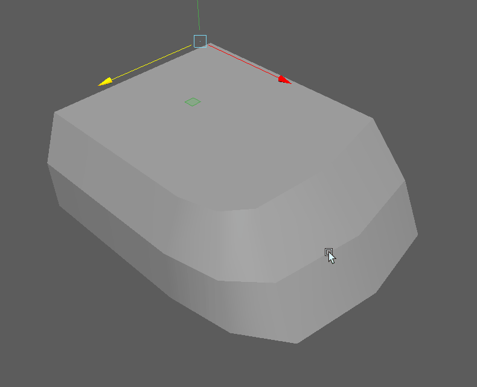

#################
Basic 3D Modeling
#################

**************
What is a Mesh
**************
A 3D object is defined by points in space and their relation and connection to each other.

    The infamous teapot 3D mesh with edges visible.

Vertices, Edges, Faces, Polygons
================================
3D objects or meshes are defined by vertices, edges and faces called 'Components' in Maya.

.. image:: ./images/vertexEdgePoly.png

You can access the components of an object by switching to a 'Component Mode'. Select
the object and press **F7** to switch to this mode or use the faster and easier way and select
one of the directions in the RightClick-hotbox.

Find out more about selecting and accessing components in the Maya Manual:

    * `Multi Component Mode <https://help.autodesk.com/view/MAYAUL/2020/ENU/?guid=GUID-9853C085-85BD-44C2-8FA6-04E3DC31A1F3>`_
    * `Select Multiple Components <https://help.autodesk.com/view/MAYAUL/2020/ENU/?guid=GUID-ABB00438-68A6-4108-8D79-C362F690E808>`_
    * `Select Specific Component Types <https://help.autodesk.com/view/MAYAUL/2020/ENU/?guid=GUID-FB4ED62E-1094-4450-AEA8-BBB3A0DA9F91>`_
    * `Converting Selection Between Component Types <https://help.autodesk.com/view/MAYAUL/2020/ENU/?guid=GUID-E6A6CDD4-5DDA-4306-9F83-2EDF83C9D4EB>`_
    * `Grow And Shrink Selections <https://help.autodesk.com/view/MAYAUL/2020/ENU/?guid=GUID-475A975C-DE5E-4D6A-AE60-D8B8E24F74E2>`_
    * `Select Only Visible Components <https://help.autodesk.com/view/MAYAUL/2020/ENU/?guid=GUID-72C0C337-FBA7-4009-9D91-57D0587A17BA>`_
    * `IMPORTANT: Select Component Loops <https://help.autodesk.com/view/MAYAUL/2020/ENU/?guid=GUID-2ADFD0C1-05C5-42EC-90F8-3035A6B21D77>`_

Valid geometry and Non-Manifolds
================================

.. figure:: https://help.autodesk.com/cloudhelp/2020/ENU/Maya-Modeling/images/GUID-7368F973-3DE2-4763-BAE2-0250359B7BCF.png

    Image from the Autodesk Maya Manual showing non manifold geometry

Maya makes it possible to create geometry that would not be possible in the real world. this
can create a huge range of errors and headaches and you should make sure not to create invalid
geometry.

Common invalid geometry types:

    * Faces that share all their edges and vertices
    * Edges that connect to more than two faces
    * Faces that share an edge have their normals pointing in opposite directions.
    * Non-planar polygons ( Manifold, but might be divided wrong on export )
    * Concave polygons ( Manifold but can cause issues when divided wrong )

.. warning::
    The following operations in Maya can produce non-manifold geometry, take special care when
    using these commands:

        * Extruding faces or edges.
        * Reversing or editing normals.
        * Merging vertices, edges or faces.

You can find and clean up these types of geometry by running the 'Mesh -> Cleanup' command 
found in the modeling toolset.

Maya Manual Link:
    `Non-Manifold Geometry <https://help.autodesk.com/view/MAYAUL/2020/ENU/?guid=GUID-8E97CEF7-1CFE-4838-B4B7-59F526E21AB2>`_
    `Mesh Cleanup <https://knowledge.autodesk.com/support/maya/learn-explore/caas/CloudHelp/cloudhelp/2020/ENU/Maya-Modeling/files/GUID-AB60C982-C96E-4947-8CF3-5152406B6A40-htm.html#GUID-AB60C982-C96E-4947-8CF3-5152406B6A40>`_

Normals
=======
Normals are a imaginary lines that are perpendicular to faces. Each face has one normal. For
shading purposes, 3D meshes use per-vertex normals. Vertex normals are not defined by a polygon
and can be edited. You can view an objects vertex normals by enabling 'Normals -> Normal Display' 
in the **Shift+RightClick** hotbox.

3D softwares decide how to shade a polygon by looking at the normal directions of its vertices.
It does not care where the polygon is pointing in the 3d world, but uses the normals to figure 
out which way a polygon faces. Manipulating normals will affect the way a polygon is lit.

Normals are the fastest way to make an edge seem 'hard' or 'soft'. While split-per-face-normals,
also called hard normals create a hard transition between faces, averaged normals called soft normals
will make the transition between faces seem smooth. You can easily switch an edges shading by using 
the Normals -> Harden or Normals -> Soften command in the **Shift+RightClick** hotbox.

.. note::
    Hard or soft normals do not define or change an objects silhouette. It only affects
    polygon shading. To create a smoother silhouette, you need either more edges or use
    subdivision.

****************************
Basic Polygon Modeling Tools
****************************

Basic transform
===============
To edit the placement of a component, you can use the standard transform tools we looked
at in :ref:`primtiveTransform`. To manipulate comopnents rather than objects, select the
object and switch to one of the 'Component Modes' using the RightClick-Hotbox.

For more options on transforming components, check out the Maya Manual
    `Overview <https://help.autodesk.com/view/MAYAUL/2020/ENU/?guid=GUID-6041BD1C-A129-444A-8737-F6EB65CA6246>`_
    `Sliding along a surface <https://help.autodesk.com/view/MAYAUL/2020/ENU/?guid=GUID-A7C41EA4-3249-4A24-A0AA-788D1F7D3DBF>`_

Soft Selection
==============
.. image:: ./images/softSelection.gif

If you want to transform a bunch of components at once but want a smooth transition between
affected components and unaffected components, you can use soft selection by pressing the
**'B'** hotkey. This is great tool to get a more sculptural feel.

Find out more about softselection in the Manual:
    `Maya Soft Selection <https://help.autodesk.com/view/MAYAUL/2020/ENU/?guid=GUID-FF7C8670-97C7-4C13-9A6F-3B0A8F881EC9>`_

The Modeling Toolkit
====================

Find out more about the Modeling Toolkit in the Manual:
    `Toolkit Overview <https://help.autodesk.com/view/MAYAUL/2020/ENU/?guid=GUID-D4CD168A-34F2-465B-A39C-DE20B34E5535>`_
    `Toolkit Hotkeys <https://help.autodesk.com/view/MAYAUL/2020/ENU/?guid=GUID-DAD42E62-3E23-4A00-93E9-4F4A193F3057>`_

Extrude 
=======

Extruding components is one of the fastest ways to add new geometry and to change flow. 
It will be very useful to create slots, growing shapes and for subdivision modeling. 
Maya's extrude tool has a lot of advanced options like extruding mutiple times, adding 
Edges, extruding along a curve and more. While you won't use these oprions a lot, they
might be handy in some cases.

In Maya, you can extrude any component. You can find the extrude command in the **Shift-Rightclick**
hotbox, in the Modeling Toolkit, the modeling shelf or in *Edit Mesh -> Extrude*
You can also hold shift and drag to extrude if you enabled it in Maya's preferences.

.. hint::
    The extrude gizmo / tool has two modes: Translate and Scale. You can switch between them by clicking
    the blue icon in the to right corner of the gizmo
    .. image:: ./images/extrudeSwitchMode.gif

.. note::
    When you watch tutorials on other 3D software, you might come across someone using an 
    'inset' command. Maya does the same when you use the extrude command and scale inwards.
    .. image:: ./images/inset.gif

Extrude in the Maya Manual:
    `Extrude Options <https://help.autodesk.com/view/MAYAUL/2020/ENU/?guid=GUID-0026EDC2-E6F7-4C57-A22F-CA6D440CE4AD>`_
    `Extrude Tool <https://help.autodesk.com/view/MAYAUL/2020/ENU/?guid=GUID-20202ED3-5EC7-420E-860E-EC29D101A7A8>`_
    `Keep Faces Togeher <https://help.autodesk.com/view/MAYAUL/2020/ENU/?guid=GUID-2D20D2B8-4B0D-465C-A244-67A9BC608663>`_

Bevel
=====

Weld / Target Weld
==================

Cut / Multicut / Insert Edgeloop
================================

Connect Components
==================

Bridge
======

Fill Hole / Grid Fill
=====================

Split, Combine and Extract
==========================

Deleting Components
===================

************************
The Construction History
************************
Maya's node-based backend will create a network of nodes called 'construction history' this 
network contains every operation you did to a mesh. You can find and edit those operations
even after doing a bunch of other edits to the mesh. However, your results can be quite unexpected.
You can delete the construction history of an object by going to 'Edit -> Delete By Type -> History'.
You can delete all construction history in the scene by going to 'Edit -> Delete All By Type -> History'.

.. warning::
    Most nodes are calculated each frame. A deep network of nodes will slow down Maya significantly.
    Deleting construction history from time to time while modeling can mitigate slowdowns and even 
    crashes.

