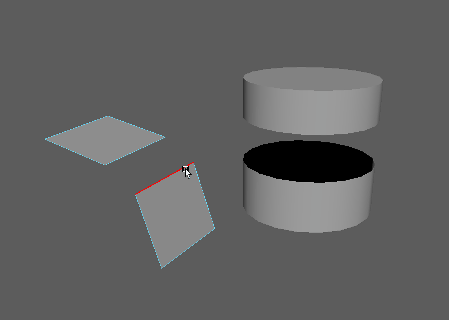

#################
Basic 3D Modeling
#################

**************
What is a Mesh
**************
A 3D object is defined by points in space and their relation and connection to each other.

.. figure:: ./images/teapot.png

    The infamous teapot 3D mesh with edges visible.

Vertices, Edges, Faces, Polygons
================================
3D objects or meshes are defined by vertices, edges and faces called 'Components' in Maya.

.. figure:: https://blenderbeginner.readthedocs.io/en/latest/_images/bl_mesh_components.png

    Vertices, edges, faces and polygons of a cube. Image by Johannes Rauch.

You can access the components of an object by switching to a 'Component Mode'. Select
the object and press **F7** to switch to this mode or use the faster and easier way and select
one of the directions in the RightClick-hotbox.

Find out more about selecting and accessing components in the Maya Manual:

    * `Multi Component Mode <https://help.autodesk.com/view/MAYAUL/2020/ENU/?guid=GUID-9853C085-85BD-44C2-8FA6-04E3DC31A1F3>`_
    * `Select Multiple Components <https://help.autodesk.com/view/MAYAUL/2020/ENU/?guid=GUID-ABB00438-68A6-4108-8D79-C362F690E808>`_
    * `Select Specific Component Types <https://help.autodesk.com/view/MAYAUL/2020/ENU/?guid=GUID-FB4ED62E-1094-4450-AEA8-BBB3A0DA9F91>`_
    * `Converting Selection Between Component Types <https://help.autodesk.com/view/MAYAUL/2020/ENU/?guid=GUID-E6A6CDD4-5DDA-4306-9F83-2EDF83C9D4EB>`_
    * `Grow And Shrink Selections <https://help.autodesk.com/view/MAYAUL/2020/ENU/?guid=GUID-475A975C-DE5E-4D6A-AE60-D8B8E24F74E2>`_
    * `Select Only Visible Components <https://help.autodesk.com/view/MAYAUL/2020/ENU/?guid=GUID-72C0C337-FBA7-4009-9D91-57D0587A17BA>`_
    * `IMPORTANT: Select Component Loops <https://help.autodesk.com/view/MAYAUL/2020/ENU/?guid=GUID-2ADFD0C1-05C5-42EC-90F8-3035A6B21D77>`_

Valid geometry and Non-Manifolds
================================

.. figure:: https://help.autodesk.com/cloudhelp/2020/ENU/Maya-Modeling/images/GUID-7368F973-3DE2-4763-BAE2-0250359B7BCF.png

    Image from the Autodesk Maya Manual showing non manifold geometry

Maya makes it possible to create geometry that would not be possible in the real world. this
can create a huge range of errors and headaches and you should make sure not to create invalid
geometry.

Common invalid geometry types:

    * Faces that share all their edges and vertices
    * Edges that connect to more than two faces
    * Faces that share an edge have their normals pointing in opposite directions.
    * Non-planar polygons ( Manifold, but might be divided wrong on export )
    * Concave polygons ( Manifold but can cause issues when divided wrong )

.. warning::
    The following operations in Maya can produce non-manifold geometry, take special care when
    using these commands:

        * Extruding faces or edges.
        * Reversing or editing normals.
        * Merging vertices, edges or faces.

You can find and clean up these types of geometry by running the 'Mesh -> Cleanup' command 
found in the modeling toolset.

Maya Manual Link:

    * `Non-Manifold Geometry <https://help.autodesk.com/view/MAYAUL/2020/ENU/?guid=GUID-8E97CEF7-1CFE-4838-B4B7-59F526E21AB2>`_
    * `Mesh Cleanup <https://knowledge.autodesk.com/support/maya/learn-explore/caas/CloudHelp/cloudhelp/2020/ENU/Maya-Modeling/files/GUID-AB60C982-C96E-4947-8CF3-5152406B6A40-htm.html#GUID-AB60C982-C96E-4947-8CF3-5152406B6A40>`_

Normals
=======
3D faces are mathematically defined faces, they have no thickness and a front and back side.
The normal defines which way of a face is 'front' and which one is back. This can be important 
as many game engines use backface culling and consider backfaces 'invisible' to save on performance. 
In Maya, backfaces are colored black by default.

For shading purposes, 3D meshes use per-vertex normals. Vertex normals are not defined by a polygon
and can be edited. You can view an objects vertex normals by enabling 'Normals -> Normal Display' 
in the **Shift+RightClick** hotbox.

.. figure:: ./images/visibleNormalsOnSphereCollage.png

    1a: Smooth Shaded Sphere, 1b: Averaged vertex normals for smooth shading, 2a: Facetted shaded sphere, 2b: per face
    normals for hard shading

3D softwares decide how to shade a polygon by looking at the normal directions of its vertices.
It does not care where the polygon is pointing in the 3d world, but uses the normals to figure 
out which way a polygon faces. Manipulating normals will affect the way a polygon is lit.
You can edit the direction of face normals with the 'Vertex Normal Edit Tool'. However, this is
only recommended in very special cases.

.. figure:: ./images/normalsAndShading.gif

    Vertex normals rotate around a polygon and change how a light affects the polygon's shading

Normals are the fastest way to make an edge seem 'hard' or 'soft'. While split-per-face-normals,
also called hard normals create a hard transition between faces, averaged normals called soft normals
will make the transition between faces seem smooth. You can easily switch an edges shading by using 
the Normals -> Harden or Normals -> Soften command in the **Shift+RightClick** hotbox.

.. image:: ./images/hardAndSoftNormals.gif

.. note::
    Hard or soft normals do not define or change an objects silhouette. It only affects
    polygon shading. To create a smoother silhouette, you need either more edges or use
    subdivision. Visuallz, hard normals will create a 100% hard edge which won't occur
    in the real world and will look unrealistic in your renders.

****************************
Basic Polygon Modeling Tools
****************************

Component Selection
===================
To edit polygon component, you need to select them. Selecting them one by one can become 
tedious quickly. Maya provides a range of ways to select multiple components at once.

To access different selection tools and constraints, access the selection tool hotbox by pressing
**Shift+Ctrl+RightClick**. 

There is a special hotbox dedicated to selection and converting between component types. 
You can access this hotbox by using **Ctrl+RightClick**. 

Component Selection in the Manual:

    * `Selection Overview <https://help.autodesk.com/view/MAYAUL/2020/ENU/?guid=GUID-98B65259-DABA-4C5E-9014-4D76B2DE28B3>`_
    * `Growing and shrinking a selection <https://help.autodesk.com/view/MAYAUL/2020/ENU/?guid=GUID-475A975C-DE5E-4D6A-AE60-D8B8E24F74E2>`_
    * `Select Edge Ring <https://help.autodesk.com/view/MAYAUL/2020/ENU/?guid=GUID-814BADD4-9D5A-4B01-ACB1-CBAD8D1026E4>`_
    * `Select Edge Loop <https://help.autodesk.com/view/MAYAUL/2020/ENU/?guid=GUID-EB713BC6-3402-4BE6-8475-BB9FF53439AA>`_
    * `Select a path between two components <https://help.autodesk.com/view/MAYAUL/2020/ENU/?guid=GUID-53C928EB-BDCF-4253-A936-18362C51B95F>`_    
    * `Converting a component selection with the Modeling Toolkit <https://help.autodesk.com/view/MAYAUL/2020/ENU/?guid=GUID-CA39C6B3-A165-40E0-98A6-8F43661E0422>`_
    * `Select Components by criteria ( planar / angle / nth .. ) <https://help.autodesk.com/view/MAYAUL/2020/ENU/?guid=GUID-2CE8BFE7-B5F0-45C3-8897-F5F1F8572FB5>`_
    * `Pick Walk Selection <https://help.autodesk.com/view/MAYAUL/2020/ENU/?guid=GUID-1DF4577E-E0C3-481A-8E16-20DF7B060E1F>`_

Basic transform
===============
To edit the placement of a component, you can use the standard transform tools we looked
at in :ref:`primtiveTransform`. To manipulate comopnents rather than objects, select the
object and switch to one of the 'Component Modes' using the RightClick-Hotbox.

For more options on transforming components, check out the Maya Manual:

    * `Overview <https://help.autodesk.com/view/MAYAUL/2020/ENU/?guid=GUID-6041BD1C-A129-444A-8737-F6EB65CA6246>`_
    * `Sliding along a surface <https://help.autodesk.com/view/MAYAUL/2020/ENU/?guid=GUID-A7C41EA4-3249-4A24-A0AA-788D1F7D3DBF>`_

Soft Selection
==============

If you want to transform a bunch of components at once but want a smooth transition between
affected components and unaffected components, you can use soft selection by pressing the
**'B'** hotkey. This is great tool to get a more sculptural feel.

Find out more about softselection in the Manual:

    * `Maya Soft Selection <https://help.autodesk.com/view/MAYAUL/2020/ENU/?guid=GUID-FF7C8670-97C7-4C13-9A6F-3B0A8F881EC9>`_

The Modeling Toolkit
====================
The Modeling Toolkit is a collection of many Maya modeling commands in one place. It allows
quick access to selection and transform constraints and can be used as your main interface
for modeling. The toolkit also has a very handy hotkey section that can be used as a cheatsheet
for the modifier keys used in modeling tools. Note that most of the tools and commands can be 
found else where as well and the Shift-RightClick hotbox can be a faster way to access them.

Find out more about the Modeling Toolkit in the Manual:

    * `Toolkit Overview <https://help.autodesk.com/view/MAYAUL/2020/ENU/?guid=GUID-D4CD168A-34F2-465B-A39C-DE20B34E5535>`_
    * `Toolkit Hotkeys <https://help.autodesk.com/view/MAYAUL/2020/ENU/?guid=GUID-DAD42E62-3E23-4A00-93E9-4F4A193F3057>`_

Extrude 
=======

.. image:: ./images/extrude.gif

Extruding components is one of the fastest ways to add new geometry and to change flow. 
It will be very useful to create slots, growing shapes and for subdivision modeling. 
Maya's extrude tool has a lot of advanced options like extruding mutiple times, adding 
Edges, extruding along a curve and more. While you won't use these oprions a lot, they
might be handy in some cases.

In Maya, you can extrude any component. You can find the extrude command in the **Shift-Rightclick**
hotbox, in the Modeling Toolkit, the modeling shelf or in *Edit Mesh -> Extrude*

You can also hold shift and drag to extrude if you enabled it in Maya's preferences.

By default, Maya's extrude tool will create new geometry by translating. You can switch it
to creating new geo by scaling by clicking one of the small cubes on top of the gizmo's arrows.

.. hint::
    By default, the extrude tool will work in direction of the components face normal. You 
    can switch it to using world translations by clicking the blue icon in the to right corner 
    of the gizmo.

    .. image:: ./images/extrudsSwitchMode.gif

.. note::
    When you watch tutorials on other 3D software, you might come across someone using an 
    'inset' command. Maya does the same when you use the extrude command and scale inwards.
    
    .. image:: ./images/inset.gif

Extrude in the Maya Manual:

    * `Extrude Options <https://help.autodesk.com/view/MAYAUL/2020/ENU/?guid=GUID-0026EDC2-E6F7-4C57-A22F-CA6D440CE4AD>`_
    * `Extrude Tool <https://help.autodesk.com/view/MAYAUL/2020/ENU/?guid=GUID-20202ED3-5EC7-420E-860E-EC29D101A7A8>`_
    * `Keep Faces Togeher <https://help.autodesk.com/view/MAYAUL/2020/ENU/?guid=GUID-2D20D2B8-4B0D-465C-A244-67A9BC608663>`_

Bevel
=====

Beveling is used to round off the harsh and unnatural edges of 3D geometry. You can find the Bevel command
in the **Shift-RightClick** hotbox, in the modeling toolkit and in *Edit Mesh -> Bevel*

Bevel in the Maya Manual:

    * `Bevel Faces <https://help.autodesk.com/view/MAYAUL/2020/ENU/?guid=GUID-40E124B1-36EA-4B85-823A-6CB2CD1BEFBE>`_
    * `Bevel Edges <https://help.autodesk.com/view/MAYAUL/2020/ENU/?guid=GUID-80605B6D-79ED-4435-99FB-928508248469>`_

Cut / Multicut / Insert Edgeloop
================================

While modeling, you will need to add geometry to your model to create details, edit edge flow or to model new 
shapes. You might also want to add something called a 'Support Loop' when subdivision  modeling.

All of these operations can be handled by the multipurpose Multicut tool and modifier hotkeys. For advanced
adding of edges, for example multiple edge loops at once, you will still have to use the single purpose tools 
'Insert Edgeloop' and 'Knife' as well as 'Connect Components'.

All these tools can be found in the **Shift-RightClick** hotbox, in edit esh and some in the Modeling Toolbox.

Find out more about adding edges in the Maya Manual:

    * `Multicut Tool Overview <https://help.autodesk.com/view/MAYAUL/2020/ENU/?guid=GUID-93324AE7-5B19-4D74-B41B-74934B4AD20C>`_
    * `Cut Faces With The Multicut Tool <https://help.autodesk.com/view/MAYAUL/2020/ENU/?guid=GUID-12DF0D57-6E5E-48E3-8FBF-F787BA4E5410>`_
    * `Multicut Tool Options <https://help.autodesk.com/view/MAYAUL/2020/ENU/?guid=GUID-B038B745-267E-4EDF-8201-EED826DC6837>`_
    * `Connect Components <https://help.autodesk.com/view/MAYAUL/2020/ENU/?guid=GUID-04D4FE26-68AE-4247-9297-592AB4575A94>`_
    * `Insert Edgeloop Tool <https://help.autodesk.com/view/MAYAUL/2020/ENU/?guid=GUID-33D62F72-8E72-4685-A7DC-73C45206F732>`_

Merge Vertices / Target Weld
============================

Merging or combining vertices allows you to attach different parts of the mesh together as well as editing topology.

There are many ways of merging and combining geomery in Maya. The most interactive way is the 'Target Weld' Tool.
Depening on the situation, other tools like merge, merge to center or collapse edge might be faster. Take some time
to try them all to get a feel which is the right tool for your operation.

All merge tools can be found in the **Shift-RightClick** hotbox in the '*Merge Vertices*' submenu, 
and some in the modeling toolbox and some in the *Edit Mesh* menu.

All merge tools in th Maya Manual:

    * `Merge Overview <https://help.autodesk.com/view/MAYAUL/2020/ENU/?guid=GUID-2DF066DD-4C1C-462E-9F8C-FA52FA9D9B16>`_
    * `Target Weld <https://help.autodesk.com/view/MAYAUL/2020/ENU/?guid=GUID-F1BFED46-9277-4B01-93A8-37946E110007>`_
    * `Collapse Edge <https://help.autodesk.com/view/MAYAUL/2020/ENU/?guid=GUID-1D8FD045-5D24-4B56-960A-AD5855719940>`_

.. note::
    To merge vertices, the mesh has to be single object. You can use `Combine  <https://help.autodesk.com/view/MAYAUL/2020/ENU/?guid=GUID-79B4AF50-94D0-424F-BCB9-1DFCCCE093AD>`__
    if you need to merge vertices between two different objects.

Bridge
======

The bridge command allows you to connect two or more border edges with faces to connect and attach separated faces.

The Bridge command can be found in the **Shift-RightClick** hotbox, *Edit Mesh -> Bridge* as well as the Modeling
Toolbox.

Find out more about the Bridge Tool and its options in the Manual:

    * `Brige Overview <https://help.autodesk.com/view/MAYAUL/2020/ENU/?guid=GUID-C3E9D5F2-6645-4F51-96AB-B417B53FD5C1>`_
    * `Bridge Options <https://help.autodesk.com/view/MAYAUL/2020/ENU/?guid=GUID-FF2E45FA-F41A-488B-9426-FB0179DA9338>`_

.. note::
    To bridge edges, the mesh has to be single object. You can use `Combine  <https://help.autodesk.com/view/MAYAUL/2020/ENU/?guid=GUID-79B4AF50-94D0-424F-BCB9-1DFCCCE093AD>`__
    if you need to bridge between two different objects.

.. warning::
    The bridge command might fail if it is provided with the wrong input meshes. The Maya Manual provides information
    on how to fix a failed bridge operation in `Troubleshooting Bridgegd Meshes <https://help.autodesk.com/view/MAYAUL/2020/ENU/?guid=GUID-5F5FA5A0-287E-4064-BD56-B08B1CB221A0>`_

Split, Extract and Detach
=========================

    Sequence of Detach, Extract and Duplicated on different meshes

You can create new geometry from existing geo by extracting or duplicating faces. This can be usefull to
create detail or if you want to keep the same form but need to edit edgeflow. Extracting and Duplicating 
will create a new object while Detaching keeps the detached faces in the same object.
You can access these tools in the **Shift-RightClick** hotbox or in the *Edit Mesh* menu.

Find out more on how to split of geometry in the Manual:

    * `Extract into a new object <https://help.autodesk.com/view/MAYAUL/2020/ENU/?guid=GUID-7268743C-C4E7-4C6A-93FA-C829D9317DDF>`_
    * `Duplicate and split <https://help.autodesk.com/view/MAYAUL/2020/ENU/?guid=GUID-C5BBD962-7A70-4F44-9A10-BC78B517A16C>`_
    * `Duplicate face options <https://help.autodesk.com/view/MAYAUL/2020/ENU/?guid=GUID-8A9AD59F-C12D-4F16-85F0-DA44392B4489>`_

Deleting Components
===================
Sometimes you may want to delete components to simplify your meshes. There are a few different ways to delete
a component in Maya. Each of them is useful in a different situation.
You can find these commands in the **Shift-RightClick** hotbox or in *Edit Mesh->Delete Edge/Vertex*.

================== ================ ========================================================================
Selected Component Action           Results
================== ================ ========================================================================
Vertices           Press 'Del'      Removes vertices that are connected to two edges, keeps all others
Vertices           'Delete Vertex'  Removes vertices and attached edges.
Edges              Press 'Del'      Removes edges, keeps vertices on intersections
Edges              'Delete Edge'    Removes edges and connected vertices
Face               Pres 'Del'       Removes faces
================== ================ ========================================================================

.. warning::
    Just pressing "Del" can quickly create a mess of unused vertices. Make sure you use the 'Delete Edge' 
    command to remove edges.

.. tip::
    To clean up stray vertices left behind by not using the 'Delete Edge' command, select all vertices by
    pressing **Ctrl+Shift+A** and press 'Del'.

    .. figure:: ./images/deleteEdge.gif
        
        1: Removing edge with delete edge, 2: Removing edge pressing "Del" and leaving behind a stray vertex.
        Stray vertex is cleaned up by selecting it and pressing "Del"

************************
The Construction History
************************
Maya's node-based backend will create a network of nodes called 'construction history' this 
network contains every operation you did to a mesh. You can find and edit those operations
even after doing a bunch of other edits to the mesh. However, your results can be quite unexpected.
You can delete the construction history of an object by going to 'Edit -> Delete By Type -> History'.
You can delete all construction history in the scene by going to 'Edit -> Delete All By Type -> History'.

.. warning::
    Most nodes are calculated each frame. A deep network of nodes will slow down Maya significantly.
    Deleting construction history from time to time while modeling can mitigate slowdowns and even 
    crashes.

