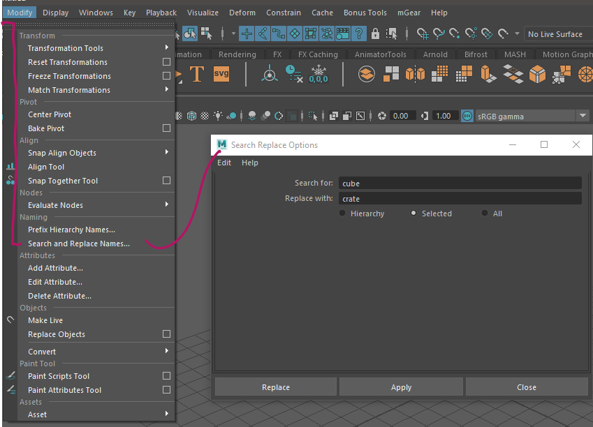
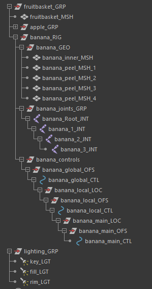
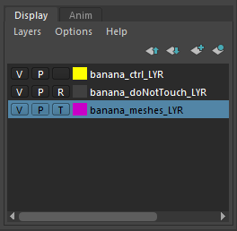
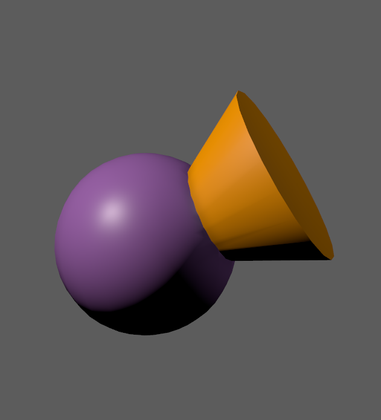
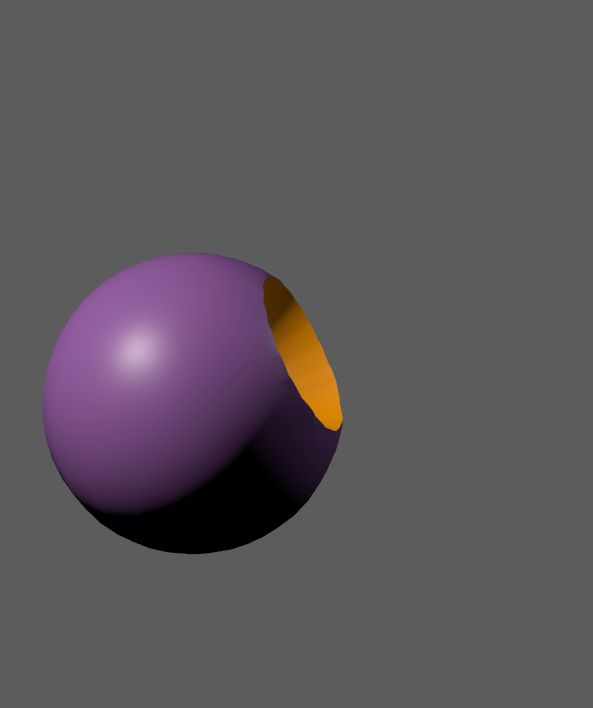
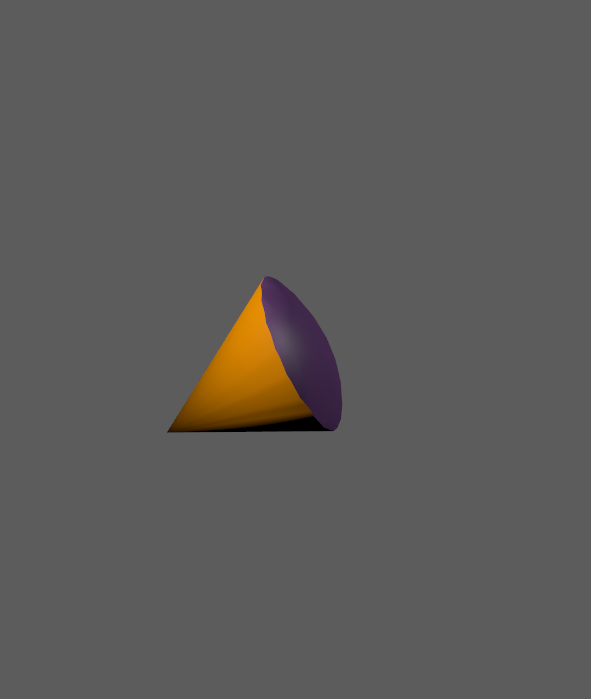

##############################
Modeling Techniques for Design
##############################

.. image:: ./images/lesson3_Crates.png

Modeling for design covers modeling techniques that allow you to create complex forms and
shapes quickly. These techniques can be used to design and ideate in 3D. They are - for the 
most part - non-destructive and help you to try different shapes without managing many of the
more complicated parts of creating 3D objects. 

.. warning::
    While you can get ideas out fast using the workflows explained in this lesson, the result
    is not production ready and must be modeled properly after a design decision has been made.
    You can think of these techniques like rough concept art or quickly sketching out ideas 
    before starting production.

************************
Scene management in Maya
************************

Up until now, we did not care to much about how objects are organized in our scene. To keep
our sanity, Maya gives us a wide range of possibilities to organize objects in hierarchical as
well as non-hierarchical ways.

Why you need to work cleanly
============================

Working in a clean manner while trying to design can be a chore at first. However, searching
for objects and digging trough a complicated mess while trying to hold that amazing design
idea in our minds is nearly impossible. Even a simple scene can be made up of hundreds of
objects while complete shots can be made up of thousands of single objects. Ensuring editability
of such a number of objects means you *must* work cleanly from the first pCube you create.

* Over the creation of a shot and scene, these short thoughs and actions you put into working
  cleanly will save you loads of time in a heavy and hard to navigate scene.

* Maya does not allow objects to share a name. This makes automation easier and let's you identify
  each object by its name without even looking at it. - On the other hand, this means you will
  need to name each node properly and with care.

* Most of the time, you will share your asset or scene with a team. Making someone else understand
  your asset quickly will save them time as well as make sure they do not need to break your flow
  to ask for an explanation of how to use the scene.


Tools for clean scenes
======================

Naming Objects
--------------

One of the most powerful tools to ensure easy understanding of the scene as well as mitigating 
name clashes is object / node naming. Find a clear name for each node you expose to the scene 
( esp. Geometry, Groups, Joints, Deformers, Materials, Textures, Shadinggroups, Layers ). If the 
same object appears a lot of time, numbering is a quick tool.
When naming your nodes, adding proper and consistent suffixes makes them easy to identify. It 
also shows how you intend to use them as well as making automation and selecting them by name 
possible.

.. hint::
    I suggest using short and recognizable suffixes. Personally, I like to tag all my meshes with
    '_MSH', joints with '_JNT', layers with '_LYR' and materials with '_MAT'. You can use your own
    suffixes or add other suffixes if you need them. (i.e. adding _EXP to stuff that needs to get 
    exported to a game engine)

Select by name
--------------

Proper naming gives you access to another often overlooked but very powerful tool: Select by name.
By typing the name of an object into the select by name box, you can quickly select an object, even
if you can't see it.

.. image:: ./images/selectByName.gif

Using the wildcard character '\*' you can select all objects that share some part of the name. If you
properly named your objects, you can, for example, select all objects with the suffix _JNT by typing
'\*_JNT' into the box.

.. image:: ./images/selectByNameWildCard.gif

Renaming a lot of objects
-------------------------

You can rename a selection, hierarchy or even all objects in the scene with the 'Search And Replace
Names' Tool. You can find this tool in **Modify > Search and Replace Names...**




The scene hierarchy
-------------------

Scenes in Maya are organized in a hierarchy of transforms. A transform that has another transform or node
below it is called 'Parent' of that node. The node below is called 'Child' or 'Decendant' of the parent 
node.

You can parent nodes quickly by selecting the child, then selecting the parent and hitting *P*.
To unparent, select any node and hit *Shift+P*.

A child node will always consider the parent nodes coordinate system as their zero coordinate system. 
Moving a parent node will change the local coordinates of the child ( and, at least in most cases, move it )

Grouping objects under a new parent transform by pressing *Ctrl+G* will create a new node that can be used 
to transform the whole group as one.

Using these principles, you can make a complex scene hierarchy easy to navigate:




Display Layers
--------------

You can use display layers to manage the visibility of objtcs. These layers can also be used do make objects
unselectable. You can find the Display Layer Manager below the Channelbox.



A layer can have multiple states, symbolized by the letters in the boxes bevore the layer.
You can change the state by clicking on the letters.

============= =================== =============== ===================
V             P                   R               T
============= =================== =============== ===================
Visibility    Playback Visibility Always Visible  Shown in wireframe
Unselectable  Selectable          Unselectable    Unselectable
============= =================== =============== ===================

You can create new layers, add, remove and select objects by using the three small buttons on top of the editor
or by selecting and **Right-Clicking** the layer name.

Autodesk Maya Manual on Display Layers:
    
    * `Display Layers Editor <https://help.autodesk.com/view/MAYAUL/2020/ENU/?guid=GUID-8415A1A6-7798-43F5-9D64-783BD0642071>`_
    * `Creating and managing Display Layers <https://help.autodesk.com/view/MAYAUL/2020/ENU/?guid=GUID-F9F5F2B3-4D2F-48F8-99BF-BF27B776158F>`_

Sets and Partitions
-------------------

https://help.autodesk.com/view/MAYAUL/2020/ENU/?guid=GUID-B1DE4646-E52B-4611-87B6-E741F25E284B
https://help.autodesk.com/view/MAYAUL/2020/ENU/?guid=GUID-8F030BC7-8F4A-4C01-978B-DECBB807B5B0

Namespaces
----------

https://help.autodesk.com/view/MAYAUL/2020/ENU/?guid=GUID-B796BE38-72AC-4B9E-9C03-3C27C3EAA171
https://help.autodesk.com/view/MAYAUL/2020/ENU/?guid=GUID-8139C5B1-3C37-43DF-965E-39800AA98EE2


***************************
Constructive Solid Geometry
***************************

.. figure:: https://upload.wikimedia.org/wikipedia/commons/8/8b/Csg_tree.png

    (Wikimedia Commons: Zottie)

What is it?
===========

Constructive Solid Geometry describes the process of creating complex forms by subtracting, intersecting
merging simpler forms. You can also find this process called *Booling* or *Boolean Modeling* which hints
at the mathematical implications of the operations ( AND, OR, XOR )

Modeling using CSG is using the three simple operations of Union, Intersection and Difference in order
to create infintely complex new geometry. In the image above, you can see how using these simple operations
in order can create geometry that would otherwise be hard to model quickly.

.. warning::
    While you can create forms and shapes quickly using constructive solid geometry, the resulting mesh
    will have many errors and problems and will need lots of clean-up to be used in production. Use CGS 
    to block out forms or for concepting, but always make sure to properly model or clean the objects 
    afterwards.


Booleans in Maya
================

Maya supports the three basic types of mesh booleans: Union, Intersect and Difference. You can find all of
them in *Mesh -> Booleans*.

================================ ================================ ===============================
Union                            Difference                       Intersect
================================ ================================ ===============================
|bool_union|                     |bool_diff|                      |bool_intersect|
Both objects are merged          Cutter is carved from the stock  Parts shared between objects
================================ ================================ ===============================





To use them select the object you want to 'cut' first ( it is sometimes called 'Stock' ) and Shift-Select
the object you want to cut with ( called 'Cutter' ). Then call one of the three boolean commands.

.. hint::
    Maya will create a bunch of objects and show you the resulting objects. You can get rid of them by
    selecting the result object and using *Edit -> Delete By Type -> History*. Note that this will also
    remove any editability of the boolean operation.

.. warning::
    Booleans only work with solid and valid geometry. 

    They will fail if your mesh ...

    * Has a hole in it
    * Is non-manifold in the area that gets booled.
    * Is intersecting itself in the cut area

Official Autodesk Manual on Booleans:

    * `Overview <https://help.autodesk.com/view/MAYAUL/2020/ENU/?guid=GUID-9467513F-47C3-4C73-8251-6FF8C0DE4982>`_
    * `Edit Original Meshes after Boolean <https://help.autodesk.com/view/MAYAUL/2020/ENU/?guid=GUID-65A99E54-E4D2-4843-9C1E-9C9D585FC976>`_
    * `Boolean Best Practices <https://help.autodesk.com/view/MAYAUL/2020/ENU/?guid=GUID-C28F1A4A-9203-4F6D-A616-A2FFA08EFB1E>`_

DCBool Manager
==============

.. image:: ./images/dcboolmanager.jpg

When you use booleans in Maya, they become invisible and are not easy to modify. For concepting
and designing, we want them editable as much and as long as possible. The script 'DCBool Manager' 
helps with that. You can download it on Gumroad: `DC Bool Manager Download <https://gumroad.com/l/LMlq>`_

Videotutorial:
    
    * `DC Bool Manager Video <https://www.youtube.com/watch?v=m2LGtvwCLy4>`_
    * `Modeling Workflow with DC Bool Manager <https://youtu.be/ZdRhp6ETA_o>`_

.. hint::
    You can install scripts in Maya on Windows by putting them into *C:/Users/[USERNAME]/Documents/maya/2020/scripts*
    Launch the script by typing ```DcBoolManager``` in a MEL tab script editor and hitting **Enter**.

.. tip::
    You can create a button for DC Bool Manager by selecting the text and **MiddleMouse-Dragging** it to a shelf
