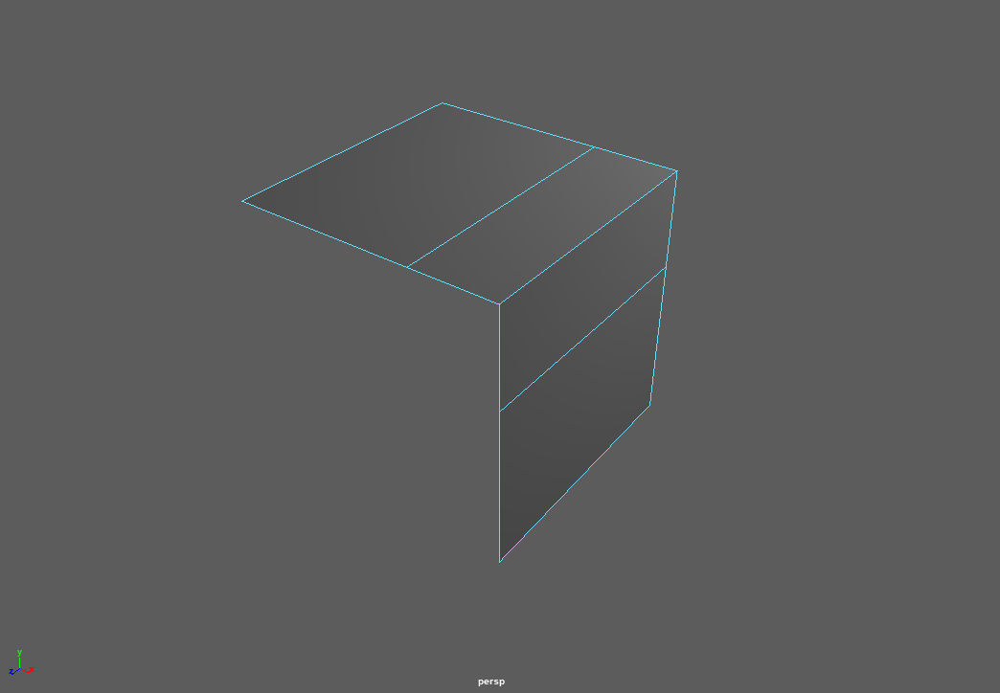
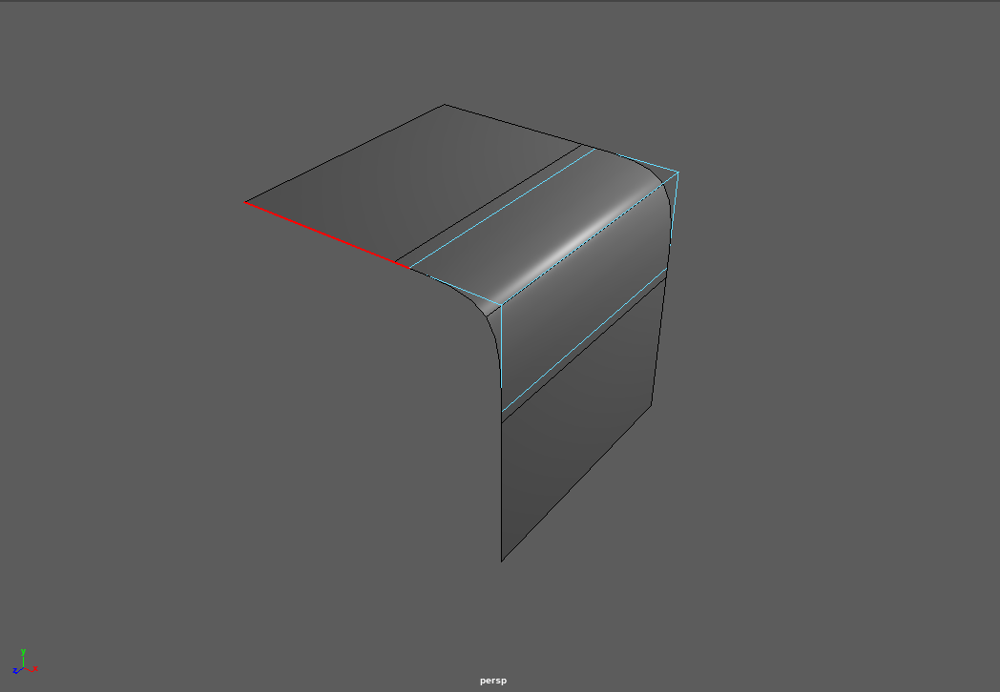
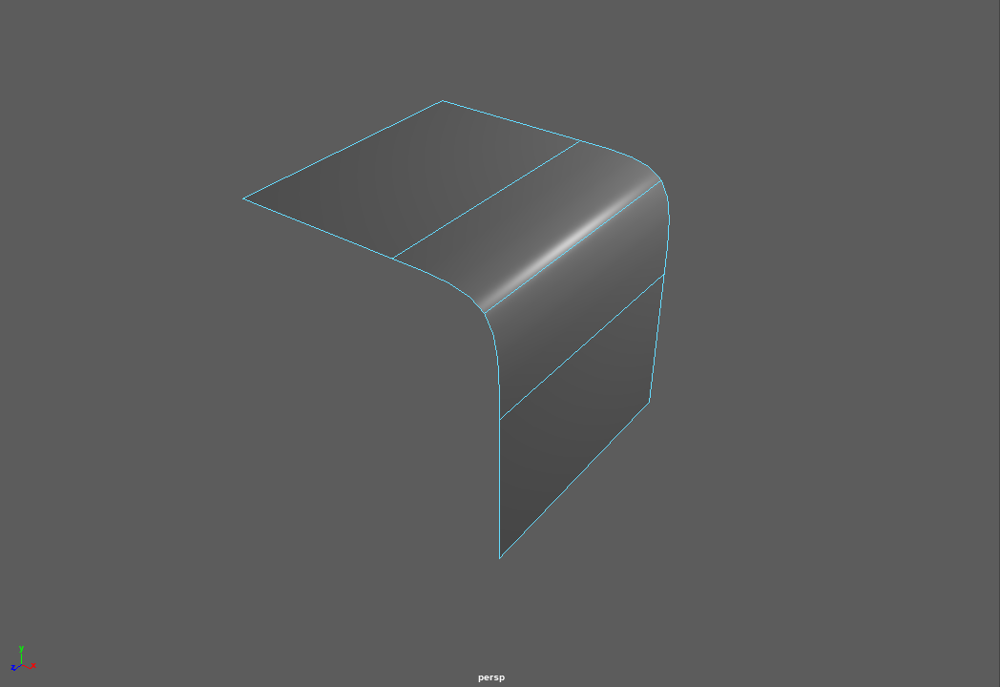
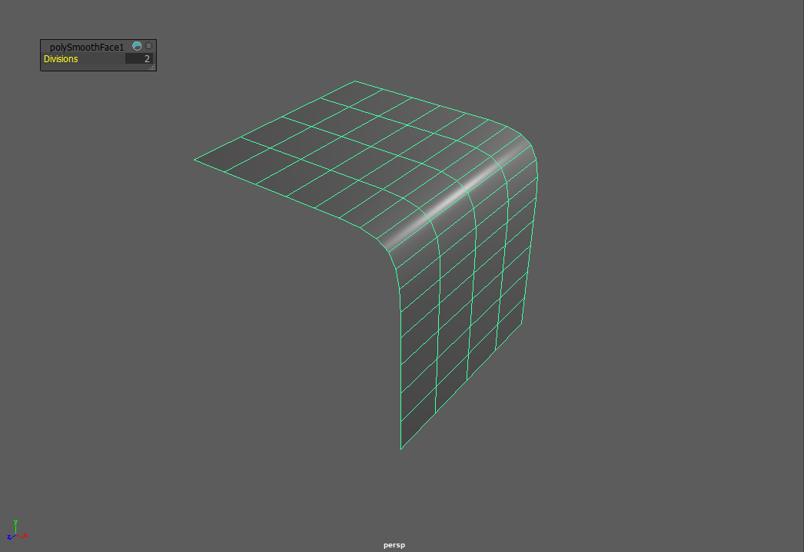
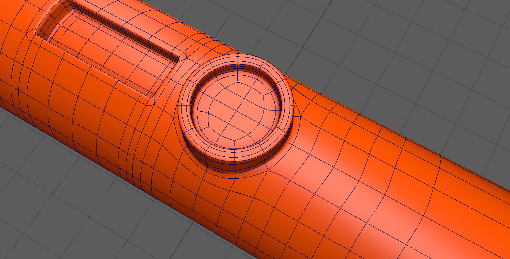
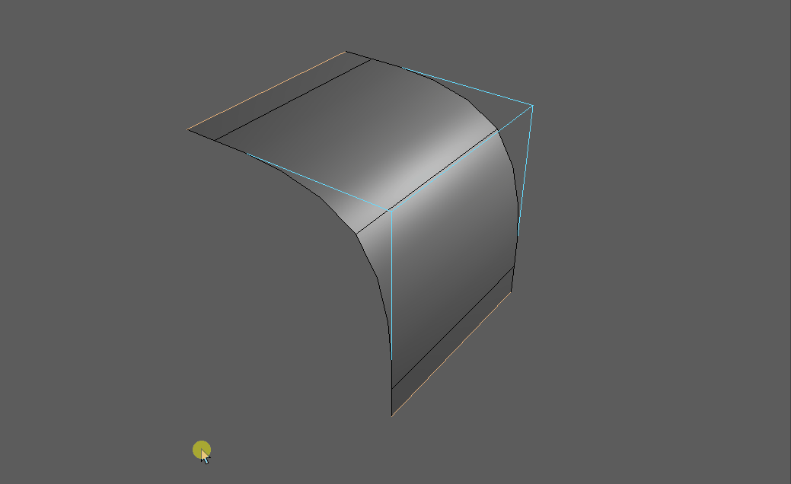
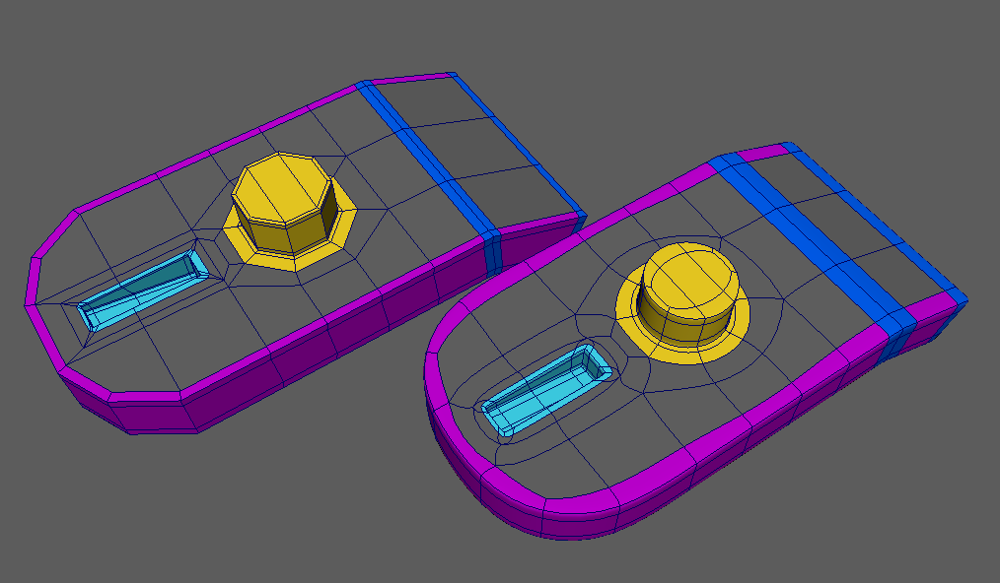
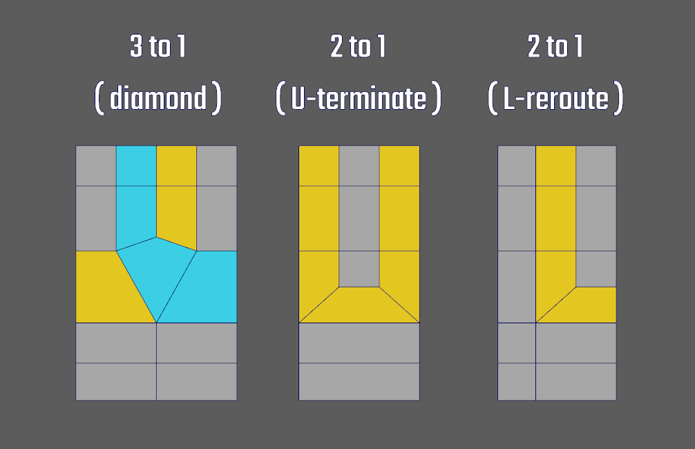
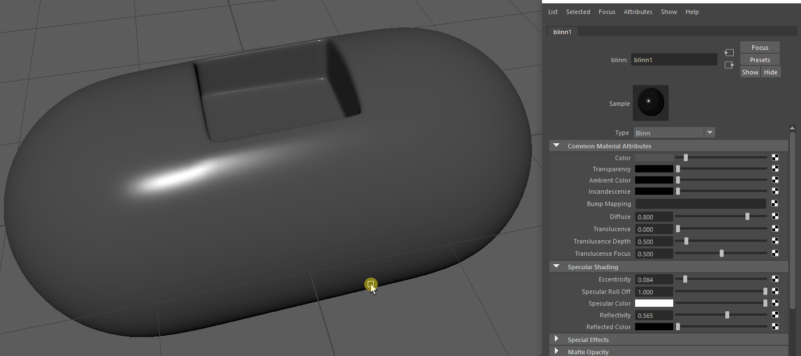

##################################
Modeling Techniques for Production
##################################

Modeling for production covers modeling techniques that will create a pipeline ready mesh when used correctly. Using subdivision surfaces and proper edge flow, we will create objects that look smooth while keeping the mesh editable. Subdivision surfaces will help us to create models that don't lose their smoothness when looked at from close on.

.. hint::
    Subdivision surfaces create dense polygon meshes which will use a lot of system memory when rendered. By themselves, they are mostly used for offline rendering. While subdivision modeling ist used a lot of time, it is not the only way to create a production mesh.

********************
Subdivision Surfaces
********************

Subdivision surfaces allow us to manipulate a smooth mesh with far less vertices than it would take to fully model a shape. It can be used to dynamically smooth the mesh at rendertime or when the camera gets closer.

Subdivision in Maya
===================

Maya has different modes of showing subdivision. Most of the time you will use a function called subdivision preview:
Press **3** to show how your model would look when subdivided. Press **1** to go back to an unsubdivided representation. You are also able to view your control cage and the subdivision result at the same time when pressing **2**.

=================== =================== ===================
Unsubdivided        Cage & Subdivided   Subdivided
=================== =================== ===================
|subdPrev_1|        |subdPrev_2|        |subdPrev_3|
Shortcut:           Shortcut:           Shortcut:
*1*                 *2*                 *3*
=================== =================== ===================

Note that this is a preview and will not be baked into the geometry model. To use subdivision while creating new geometry, go to *Mesh -> Smooth*. 

.. note::
    By default, Maya will use the open source *OpenSubdiv* algorithm. This means it will subdivide the mesh the same in different applications that implement it, making it possible to transfer unsmoothed meshes while getting exactly the same results when smoothing ( i.e. in Renderers, when exchanging between programs etc. )

There is a lot of information about the different options and algorithms Maya offers. All of them are explained in the official Manual:

    * `Mesh Smooth Preview <https://help.autodesk.com/view/MAYAUL/2020/ENU/?guid=GUID-BF4C21CB-C149-449F-925D-5456B1D96EB7>`_
    * `Mesh Smooth Usage <https://help.autodesk.com/view/MAYAUL/2020/ENU/?guid=GUID-C4442D89-990B-4302-AF60-E21FCA22D4F3>`_
    * `Mesh Smooth options, algorithms and more <https://help.autodesk.com/view/MAYAUL/2020/ENU/?guid=GUID-FF35F773-1FC0-4EBA-A64C-6199375F489A>`_

What is subdivision - The Algorithm
===================================

Subdivision is a recursive algorithm that splits an input objects edges down the middle to create new, smoothly interpolated vertices and edges. While this interpolation happens slightly different in each software, each of the implementations has an *Divisions Parameter*. In other softwares this might be called *Iterations*. We can use this parameter to control how much new geometry is created and how 'smooth' our meshes become.

.. figure:: ./images/subd2D.gif

    2D line being subdivided with rising iterations.

In 2D, this algorithm is easy to understand: Each edge gets split in the middle, creating two new edges. The result then gets interpolated using a spline algorithm. 

.. note::
    Due to the spline interpolation algorithms used, the resulting geometry's vertices do not match the source geometry inside the borders. 

In 3D, the same calculations happen, but this time on a surface. Each surface gets split down its two axies, creating new faces. Quads are the easiest to calculate and will create four new faces per faces. Notice how interpolation changes the mesh's dimensions and shape drastically, creating smoother and smoother forms.

.. figure:: ./images/subd3D.gif

    3D cube being subdivided with rising iterations

.. warning::
    Due to the edge splitting algorithm used by subdivision surfaces, it works the most predictable on **even, quadrilateral faces**, also called 'quads'. While triangles and n-gons *can* be interpolated and result in quads after their first division, they are prone to creating smoothing artifacts on curved surfaces.

Topology for subdivision surfaces
=================================

Subdivision can change the shape of a mesh quite drastically, depending on the layout of the faces, edges and vertices it uses as an input. This layout is called **'Topology'** ( or 'Topo' for short ). Meshes and Topology used as an input for subdivision surfaces is also called **'Control Cage'**.

To use subdivision surfaces in a predictable manner, our control cages must be set up in a certain kind of way using **'Edge Loops'** and **'Edge Rings'** that follow the shapes of our object. This layout of edges is called **'Edge Flow'**.

Good Topology and Edge Flow will minimize shading and smoothing artifacts such as **'Pinching'**, **'Bumps'**, and **'Lumpyness'**.

.. note::
    Getting good results from subdivision is not the only reason to create meshes with good topology / edgeflow. It is also a crucial factor to get nice deformations when animating or deforming the objects.

Supporting Edges - The rule of three
------------------------------------

Subdivision smoothes the surface between the points defined in your control cage. This means the shape of the resulting surface will be more interpolated and rounder when edges in your control cage are far apart while adhering tighter to your control cage when they are placed close to each other.

To keep a sharper edge, you need to add **support edges** to either side of the edge. While one edge might harden your edge enough, two are preferreable as they will create a rounder and more predictable result. Holding edges that are closer to the edge they control will create a tighter crease while edges that are furhter from the crease will create a more round, beveed shape. Adding two edges resultes in three edges total which have further benefit when we talk about `Edge termination and rerouting loops`_.

Fencing - Border Loops
----------------------

To be a able to use supporting edges in the places we want them, we need to layout our mesh with the specific aim to create edge rings around them. These rings around features of our shape are called **Edgeloops**. Edgeloops can be used like 'borders' to separate different shapes and areas in our mesh. These are called **Borderloops**. 

.. note::
    Most of the time, we want loops to be continuous and return back to their start. Try to stay away from an endless spiral ( **Spiralloop** ) or random flow in your mesh layout.

    A Mesh with border loops colored in different colors in unsubdivided and subdivided form.

Edge termination and rerouting loops
------------------------------------

When constructing our mesh with border and holding edges, we will create high polygon count meshes that can be hard to work with and which might not smooth the way we want. To combat this, we want to keep the dense mesh areas local to the edges we want to support. This means we need ways to 'terminate' the dense flow and merge it back into a layout that is much easier to work with.
Because of the subdivision algorithm working best with Quads, we can't just remove the edges ( and create an n-gon ) or merge them ( and create a triangle ). As this problem is a very common one, most solutions have already been worked out. 

As each mesh is different, there will be a lot of cases where you will have to figure out the best way to create the flow you want. In such a case, don't give up, save early and try different methods of cutting, merging and inserting loops. With time, you will build a set of solutions to solve such problems quickly. 

A set of real world problems, solutions and discussion can be found here:

    * `How to model them shapes - full thread <https://polycount.com/discussion/56014/how-the-f-do-i-model-this-reply-for-help-with-specific-shapes-post-attempt-before-asking>`_
    * `How to model them shapes - images only <https://polycount.com/discussion/157205/how-u-model-dem-shapes-image-ripped>`_

.. warning::
    Read the discussion thread to learn, repeating other's solutions without understanding won't help you next time.

How much geo do you need? Animation considerations
--------------------------------------------------

While we can model a static form with a fairly low density cage, you might want to deform it later, either for animation or using a deformer. This means that the form, especially a softer form ( People, Clay, Soft Plastic ) will have support multiple poses when used with deformers or in animation. In a lot of cases this means to add more loops to support deformations, even if they might not be that visibly used in the undeformed / static position.

Check out this interesting example by `Jonathan Gagon <https://www.artstation.com/lamo>`__: `Character Face Study <https://www.artstation.com/artwork/Zmryw>`__.
Even while the character is stylized and seems very smooth, it uses a denser mesh than you might anticipate at first. This is used to support a huge range of expression and deformation.

.. image:: https://cdna.artstation.com/p/assets/images/images/007/589/074/large/jonathan-gagnon-bust-clay-wireframe-squash-angle-00000.jpg?1507153607
    :width: 49%

.. image:: https://cdnb.artstation.com/p/assets/images/images/007/589/067/large/jonathan-gagnon-bust-clay-wireframe-stretch-angle-00000.jpg?1507153582
    :width: 49%

Subdivision artifacts and problems
==================================

Subdivision might hard to spot pinching and bumps. While these aren't that bad in the viewport, they will show their ugly side when rendered, especially in shiny or reflective materials. In a game pipeline, they will show up in normalmaps baked in a high-to-low poly workflow. There are different techniques to spot and prevent or minimize those problems, but all of them have to be a concious effort by the modeler.

Materials to spot topology problems
-----------------------------------

It is easy to spot big lumps in your mesh or to make sure the subdivision creates the shape you want. However, there are a lot of the smaller pinching or smal bumps, mostly created by suboptimal edgeflow, that can be hard to spot in the viewport. These areas will show up in your render and they will show up in the most subpotimal places.

To make it easier to spot such areas you need to create a highly specular material and watch how the specular distorts and flows around your shapes when orbiting the camera.

Settings:
    * Blinn or Phong Material
    * Dark Grey Diffuse Colour
    * Small Eccentricity ( < 0.01 )
    * Bright Specular Colour

.. note::
    Matcaps, especially Zebra-Matcaps, can be a faster way to check your model. Sadly they are not implemented in Maya yet and you need to use a plugin if you want to use Matcaps in the maya viewport. You can find a plugin to use the `blender matcaps <https://blenderbeginner.readthedocs.io/en/latest/_downloads/757b9959c91f808804e02a03769746f8/subd_matcaps.zip>`__ here: `Maya Matcap Plugin <https://www.artstation.com/artwork/8lrk2n>`_

Spreading loops
---------------

Terminating loops
-----------------

Adding enough geo - Cylinders and rounded surfaces
--------------------------------------------------

Common modeling techniques
==========================

Adding geo to create details
----------------------------

Edge termination on flat surfaces
---------------------------------

Create ( round ) holes
----------------------

Creating holding edges
----------------------
 * While extruding
 * With bevel

Using quick cut to solve topology problems
------------------------------------------

Split mesh for new topology
---------------------------

Subdividing the mesh for smaller details
----------------------------------------

General approach to fix artifacts
---------------------------------
