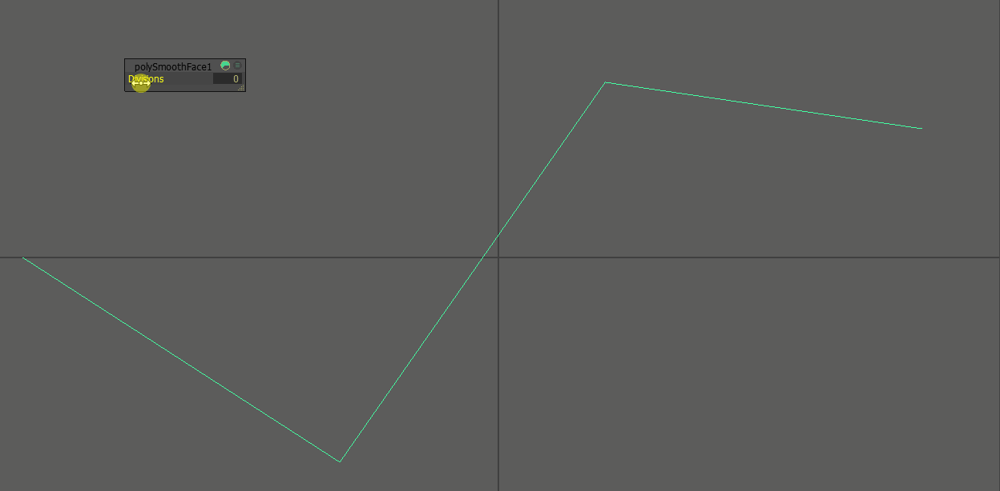
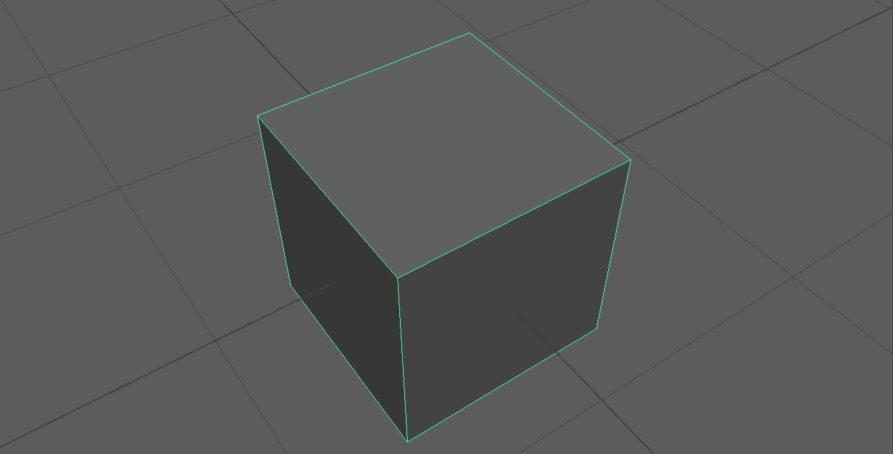

##################################
Modeling Techniques for Production
##################################

Modeling for production covers modeling techniques that will create a pipeline ready mesh when used correctly. Using subdivision surfaces and proper edge flow, we will create objects that look smooth while keeping the mesh editable. Subdivision surfaces will help us to create models that don't lose their smoothness when looked at from close on.

.. hint::
    Subdivision surfaces create dense polygon meshes which will use a lot of system memory when rendered. By themselves, they are mostly used for offline rendering. While subdivision modeling ist used a lot of time, it is not the only way to create a production mesh.

********************
Subdivision Surfaces
********************

Subdivision surfaces allow us to manipulate a smooth mesh with far less vertices than it would take to fully model a shape. It can be used to dynamically smooth the mesh at rendertime or when the camera gets closer.

What is subdivision - The Algorithm
===================================

Subdivision is a recursive algorithm that splits an input objects edges down the middle to create new, smoothly interpolated vertices and edges. While this interpolation happens slightly different in each software, each of the implementations has an *Divisions Parameter*. In other softwares this might be called *Iterations*. We can use this parameter to control how much new geometry is created and how 'smooth' our meshes become.

    2D line being subdivided with rising iterations.

In 2D, this algorithm is easy to understand: Each edge gets split in the middle, creating two new edges. The result then gets interpolated using a spline algorithm. 

.. note::
    Due to the spline interpolation algorithms used, the resulting geometry's vertices do not match the source geometry inside the borders. 

In 3D, the same calculations happen, but this time on a surface. Each surface gets split down its two axies, creating new faces. Quads are the easiest to calculate and will create four new faces per faces. Notice how interpolation changes the mesh's dimensions and shape drastically, creating smoother and smoother forms.

    3D cube being subdivided with rising iterations

.. warning::
    Due to the edge splitting algorithm used by subdivision surfaces, it works the most predictable on **even, quadrilateral faces**, also called 'quads'. While triangles and n-gons *can* be interpolated and result in quads after their first division, they are prone to creating smoothing artifacts on curved surfaces.

Topology for subdivision surfaces
=================================

.. image:: ./images/subdMeshExample.png

Subdivision can change the shape of a mesh quite drastically, depending on the layout of the faces, edges and vertices it uses as an input. This layout is called **'Topology'** ( or 'Topo' for short ). Meshes and Topology used as an input for subdivision surfaces is also called **'Control Cage'**.

To use subdivision surfaces in a predictable manner, our control cages must be set up in a certain kind of way using **'Edge Loops'** and **'Edge Rings'** that follow the shapes of our object. This layout of edges is called **'Edge Flow'**.

Good Topology and Edge Flow will minimize shading and smoothing artifacts such as **'Pinching'**, **'Bumps'**, and **'Lumpyness'**.

.. note::
    Getting good results from subdivision is not the only reason to create meshes with good topology / edgeflow. It is also a crucial factor to get nice deformations when animating or deforming the objects.

Supporting Edges - The rule of three
------------------------------------

Subdivision smoothes the surface between the points defined in your control cage. This means the shape of the resulting surface will be more interpolated and rounder when edges in your control cage are far apart while adhering tighter to your control cage when they are placed close to each other.

To keep a sharper edge, you need to add **support edges** to either side of the edge. While one edge might harden your edge enough, two are preferreable as they will create a rounder and more predictable result. Adding two edges resultes in three edges total which have further benefit when we talk about `Edge termination and rerouting loops`_.

Fencing - Border Loops
----------------------

Edge termination and rerouting loops
------------------------------------

How much geo do you need? Animation considerations
--------------------------------------------------

Subdivision artifacts and problems
==================================

Materials to spot topology problems
-----------------------------------

Spreading loops
---------------

Terminating loops
-----------------

Adding enough geo - Cylinders and rounded surfaces
--------------------------------------------------

Common modeling techniques
==========================

Adding geo to create details
----------------------------

Edge termination on flat surfaces
---------------------------------

Create ( round ) holes
----------------------

Creating holding edges
----------------------
 * While extruding
 * With bevel

Using quick cut to solve topology problems
------------------------------------------

Split mesh for new topology
---------------------------

Subdividing the mesh for smaller details
----------------------------------------

General approach to fix artifacts
---------------------------------
