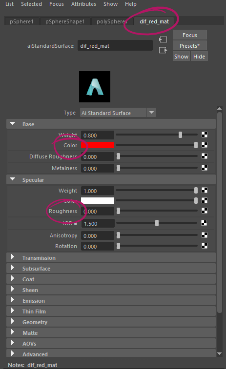
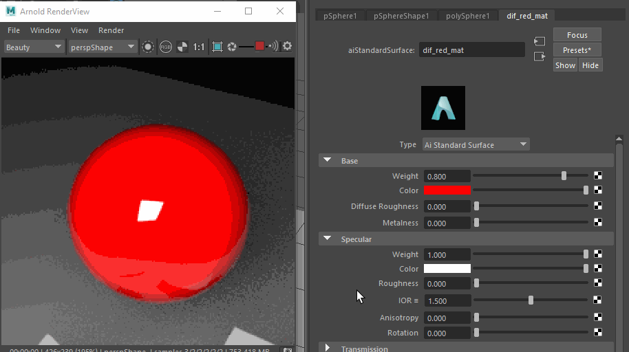
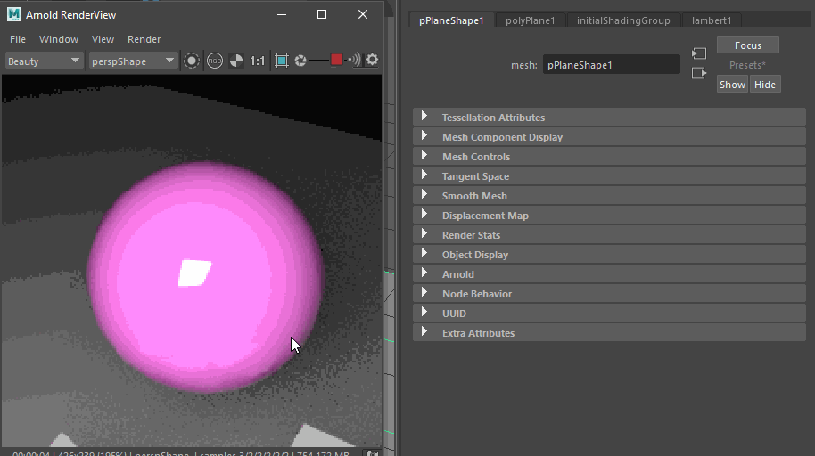

#########
Surfacing
#########

Surfacing is the process of creating materials and surfaces that feel a certain way. With modern render engines you can get pysically correct materials while keeping artistic control over the look.
We will be using Arnold, the render engine that ships with Maya, but most of these concepts transfer to all other ray- and pathtracing engines that use pbr and bsdf materials.

*****************
Materials in Maya
*****************

To create a surface you will need to create a material and assign it to faces on your object.

Creating a basic material
=========================
An object's color in a 3D scene is defined by the shader that is assigned to the 3D mesh. 

While shaders can come in many different forms, we will be using surface shaders called 'Materials'. Arnold gives us a choice of many different material types, but we want to focus on the often used and very versatile `Standard Surface <https://docs.arnoldrenderer.com/display/A5AFMUG/Standard+Surface>`__.
The standard surface is a physically based 'PBR' shader capable of producing many different types of materials by mixing different property layers. 

Assigning a material
====================
You can create materials in different ways.

The fastest way is by using the right-click hotbox:

To create a new material:

    .. image:: ./images/assignNewStandardSurface.png

    1. Right-click the object you want to assign a material to.
    2. Choose 'Assign New Material...'
    3. The window for creating new nodes appears.
    4. Click 'Shader' below the 'Arnold' heading to show Arnold shaders only
    5. Choose 'aiStandardSurface' to create a Standard Surface shader.
    6. Set the settings of the material in the attribute editor.
    7. Make sure to rename the material to something you can remember easily.

To assign an existing material:

    .. image:: ./images/assignExistingMaterial.png
    
    1. Right-click the object you want to assign a material to.
    2. Choose 'Assign Existing Material...'
    3. Choose the material from the list.

You can also create and assign materials using the `Hypershade Window <https://help.autodesk.com/view/MAYAUL/2020/ENU/?guid=GUID-252707EC-4AAF-4D3F-9600-804F783652B7>`__.
This is a little slower than the hotbox but it will allow you to edit and set up complex material setups.

Changing a material's settings
==============================

To adjust a materials settings, find the material node in the attribute editor:
There are many different ways to get to the material node:

* *Right-click > Material Attributes...* will open the material node of the selected object in the Attribute Editor. 
* Click the object and find the tab in the attribute editor that has the material's name. 
* Find the material in the Hypershade's Material Catalog and click it there. The Hypershade has the benefit of providing a special 'lookdev' window that shows you preview of the material.

.. note::
    Maya has a bug where using 'Material Attributes...' with the attribute editor closed will only open the attribute editor. Do the same thing again to get to the material node.

Main material settings
======================

Physical materials are defined by their Albedo ( also called Diffuse color ), Metalness, Roughness, Translucency and their physical Index Of Refraction as well as their incandecency.

Albedo / Diffuse
----------------

'Diffuse'/'Color' defines the main color of the material:

Roughness
---------

'Specular'/'Roughness' changes the simulated Roughness of the material. A value of 0 means the object will be completely specular and reflective. Most harder plastic looks like this. 
A value of 1 makes the material a completely diffuse material with very little reflections. 

Metalness
---------

In the real world, materials can be metals ( conductors ) or non-metals ( insulators ). Both types have special visual qualities, inlcuding complex fresnel and reflections.

In Arnold, you can make a material seem like a metal by using the metalness slider. Additionally, some metals like gold, copper etc. need a colored specular to seem real. The `Arnold Documentation <https://docs.arnoldrenderer.com/display/A5AFMUG/Base>`__ has a nice list of color and specular settings for a bunch of different metals.

.. note::
    Metalness should either be zero or one for physical materials - there are no 'Half-Metals' occuring in nature.

Specular
--------

TODO, 
Documentation: `LINK <https://docs.arnoldrenderer.com/display/A5AFMUG/Specular>`__

Transmission
------------

TODO, Documentation: `LINK <https://docs.arnoldrenderer.com/display/A5AFMUG/Transmission>`__

You can find these settings explained in more detail and with nice examples in the Arnold Manual
    
    * `Base <https://docs.arnoldrenderer.com/display/A5AFMUG/Base>`__
    * `Specular <https://docs.arnoldrenderer.com/display/A5AFMUG/Specular>`__
    * `Transmission <https://docs.arnoldrenderer.com/display/A5AFMUG/Transmission>`__

Additional Settings
===================

Most renderers offer the possibility to simulate complex materials in their base surface. These include complex fresnel, emission and volume properties such as subsurface.

Emission
--------

Emissive materials can be created by opening the 'Emissive' Rollout of the Arnold Standard Surface and driving up the weight of the emission. You can set a color by choosing a 'Color' in the Emissive rollout.

.. image:: ./images/arnold_ChangeEmission.gif

.. note::
    Emissive materials in Arnold will create light just like a light would. They will light up objects around them.

Emission in the Arnold Manual:

    * `Emission <https://docs.arnoldrenderer.com/display/A5AFMUG/Emission>`__

Complex Surfaces and Volumes
----------------------------

While the base settings can be enough to simulate any material, it can simply be to complex or to computationally expensive to create some features of materials. Arnold has extra settings to simulate these complex material behaviours.

You can find them in the documentation:

    * `Subsurface Scattering <https://docs.arnoldrenderer.com/display/A5AFMUG/Subsurface>`__
    * `Clear Coat <https://docs.arnoldrenderer.com/display/A5AFMUG/Coat>`__
    * `Sheen <https://docs.arnoldrenderer.com/display/A5AFMUG/Sheen>`__
    * `Thin Film <https://docs.arnoldrenderer.com/display/A5AFMUG/Thin+Film>`__

********
Textures
********

You can assign a texture map to *any* shader slot in the material. This makes it possible to set up different materials in one shader.

Images vs. Data Textures
========================

While any channel will accept any image, there are differences on how the data is handled and how your image needs to be set up. Since Maya's texturing pipeline is heavily colormanaged we need to make sure to plug in the correct data, even if Maya selects the correct settings based on the channel most of the time.

The simple question is: *Will the colors in the image be seen in the final render?*

    * **Yes:**    This texture is most likely a color image and needs to be colormanaged
    * **No:**     This texture is most likely data and we are only interested in the per-pixel-values, not the color. 

.. note::
    | While data-'images' will most likely be greyscale and contain a single value per pixel, there are cases in which the data-'image' is a colorimage. In that case, it might either contain a vector per pixel, as in i.e. normalmaps or it might be a combination of multiple greyscale images. In such cases, each channel of this image is a greyscale data-'image' that got combined into a single image to save on memory. You can get this data out by using the node editor or hypershade to connect the single color channels to their attributes.
    | In both cases, you have to make sure these images are **not** colormanaged my Maya by setting the colorspace in the fileNode to '*raw*'.

    .. image:: ./images/imageColorSpace.png
    

Assinging Textures
==================

1. Open the Material Attributes in the Attribute Editor and find the attribute you want to add a texture to, for example 'Color'. - Click the small checkerboard icon.

    .. image:: ./images/textureSlot.png

2. From the 'Create Render Node' menu that opens up choose one of the texture render nodes available - if you want to add an image, choose '*File*'

    .. image:: ./images/createRenderNodeMenu.png

3. In the image file node, click the folder button to add your texture image

    .. image:: ./images/fileNode.png

*********************************
Complex Node-Based Texture Setups
*********************************

You can use Maya's node-system to set up complex shader networks to procedurally generate a large number of textures.

.. hint::
    All images contain the 4 channels **Red**, **Green**, **Blue** and **Alpha**. These channels hold a **single float from 0 (Black) to 1 (White) per pixel** - all numbers inbetween are represented as different shades of grey. Mixing images (no matter which program) will *always* use math with these values to calculate the resulting value.