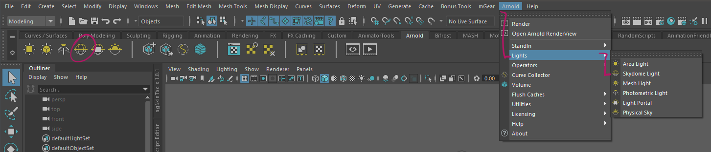
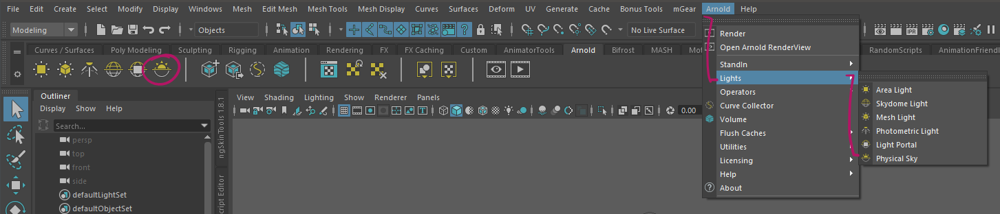
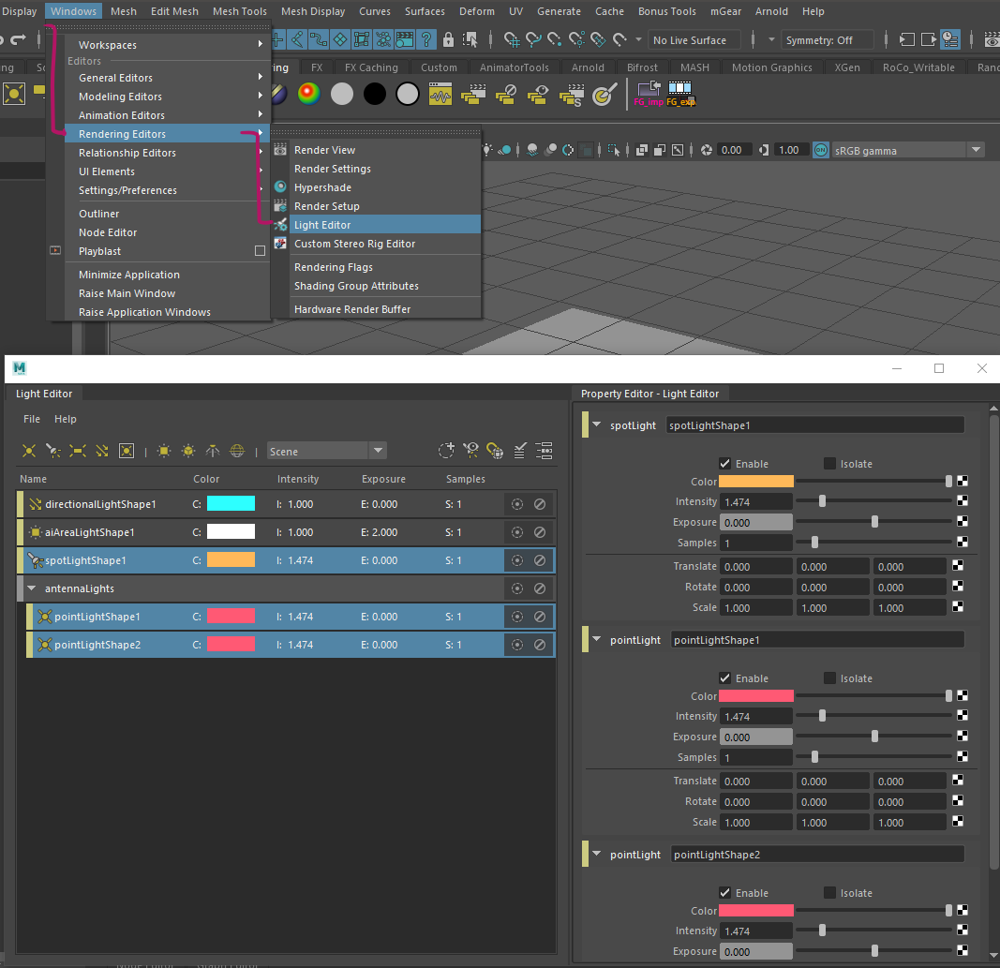

##############
Lights in Maya
##############

This will be a very short look into lighting with Maya lights and Arnold. This section is by no means exhaustive. This section will be an overview about the techincal side of lighting in Maya and give you the tools light in a basic sense. Check out the Light Section in the design part for pinciples and creative tools.

There are a lot of different light types in Maya and all of them are supported by Arnold. This guide will contain a lot of links to the 
`Arnold User Manual <https://docs.arnoldrenderer.com/display/A5AFMUG/Arnold+for+Maya+User+Guide>`__ where you can find out more about each light's settings.

***********
Light Types
***********

Skylight / Physical Sky
=======================
The `Arnold Skydome Light <https://docs.arnoldrenderer.com/display/A5AFMUG/Ai+Skydome+Light>`__ 
simulates light from an infinite sphere around the scene. You can use this with a flat color, 
HDRI light enviroments or the `Physical Sky <https://docs.arnoldrenderer.com/display/A5AFMUG/Physical+Sky>`__
that simulates how a real sky would light your scene.

You can create a Skydome light by going to **Arnold -> Lights -> Skydome Light**. This will create 
a white skydome. You can adjust brightness and colors in the attribute editor.

To create a physical Sky, go to **Arnold -> Lights -> Pyhsical Sky**. This will create a physical
sky that lets you change the color and light direction by modifying sun height and position.

Lights
======
Arnold supports all Maya lights and provides its own `Area Light <https://docs.arnoldrenderer.com/display/A5AFMUG/Ai+Area+Light>`__.
Arnold lights can be created from the **Arnold -> Lights** Menu. 

Maya lights can be created by using the light buttons on the *Rendering* shelf or from the **Create -> Lights** Menu.

Check out the Arnold Manual for more  Information on the different light types:

    * `Lights <https://docs.arnoldrenderer.com/display/A5AFMUG/Lights>`__
    * `Area Lights <https://docs.arnoldrenderer.com/display/A5AFMUG/Ai+Area+Light>`__
    * `Point Light <https://docs.arnoldrenderer.com/display/A5AFMUG/Point+Light>`__
    * `Spot Light <https://docs.arnoldrenderer.com/display/A5AFMUG/Spot+Light>`__
    * `Directional Light <https://docs.arnoldrenderer.com/display/A5AFMUG/Spot+Light>`__

.. hint::
    Arnold's default settings for lights can be quite dark. You can use a lights exposure or intensity parameter to increase the light's strength.

.. note::
    Lights in Arnold have two values to control the lights power, *Intensity* and *Exposure*.
    The only difference here is that *exposure* works like a real light would work: Increasing 
    the power value by one will output double the amount of light.
    *Intensity* will increase the output in a linear fashion.

***************
Managing Lights
***************

The light count in your scene can rise quickly and you might want to edit a bunch of lights at once. Since the Attribute Editor alone won't allow you to do this. Luckily there are some specialized tools for this task available in Maya.

Maya Light Editor
=================

For easy access to all lights in the scene, you can use the `Light Editor Window <https://help.autodesk.com/view/MAYAUL/2020/ENU/?guid=GUID-72B6C563-E93A-4A03-8F9B-8168FB8E3C52>`__. Open the Light Editor by going to *Windows > Rendering Editors > Light Editor*.
This editor also lets you organize, group and manage all the lights in your scene.

.. note::
    All lights have powerful settings and parameters that can make or break your scene. Check the documentation linked above for examples and play around with the settings for a good image.
    Try different light directions and look at the shadows that get created by your sky's light direction.