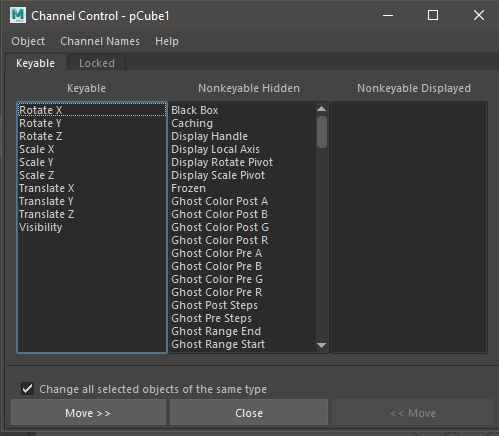
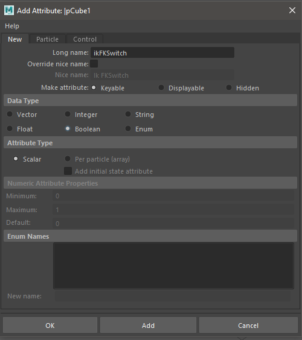
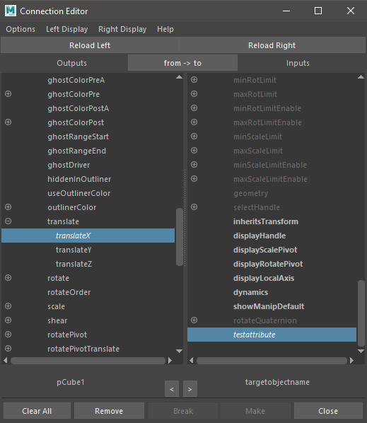
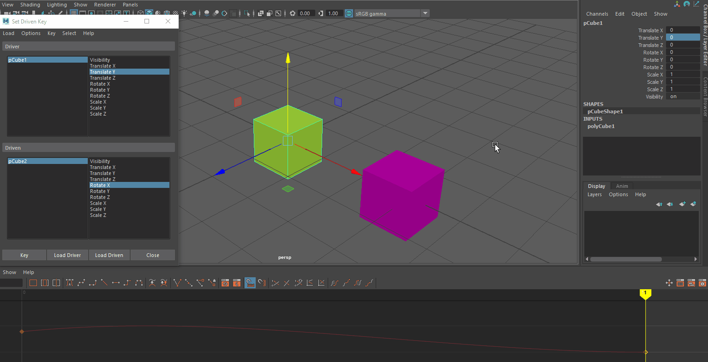
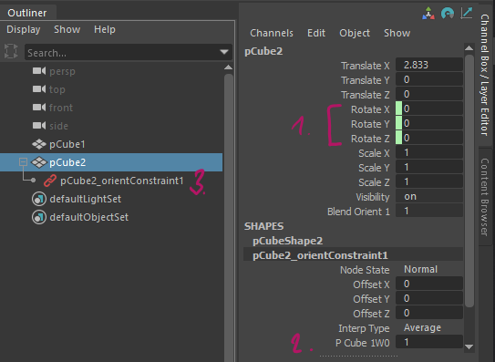

#####################
Rigging for Animation
#####################

The process of creating a control structure that allows us to easily pose and animate our models is called *rigging*. The final product is a model with controllers that allow us to easily pose and animate.

The rigging process is twofold: First we want to create a virtual skeleton and controls for the model and set it up to be manipulated easily. This includes technical setups for easier manipulation. 
Second we want to attach or *'bind'* our model to that skeleton.

**************
Basic concepts
**************

Rigging aims to make animation as easy as possible by creating simple and easy controls to an animator. If possible, we want to try to hide and simplify complexity and make it easy to grasp all functions of our rig at a glance.

Attributes and Channels
=======================

Most animation in Maya relies on changing the values in different channels and attributes over time. In Maya, you can expose any channel on a node to be animated in the channelbox. By default, the most important animation channels are visible and keyable: Translate, Rotate, Scale and Visibility.

If you want to change which channels are shown, you can add channels to the visible and keyable list in the Channel Editor.
You can find the Channel Editor in the Channel Box's *Edit > Channel Control*.
Select attributes and use the 'Move' buttons to change the attributes state.

You set the status of shown channels by selecting them in the Channel Box and *Right-Clicking* to open the context menu. To the bottom of the menu, you can find the options to 'Hide Selected', 'Make Selected Non-Keyable', 'Make Selected Keyable'.

Channels can also be 'locked'. Locking keeps a channel from being manipulated. Choose 'lock selected' to lock a channel.

.. note::
    It is a good idea to lock channels that should not be changed after the rig is built. Examples are the transformations of anything but controls or driven channels.

You can find more information in the official manual:

    * `Channel Control Editor <https://help.autodesk.com/view/MAYAUL/2020/ENU/?guid=GUID-5636D755-8FA3-4E72-83AD-A67956727D55>`_
    * `Making a channel keyable or non-keyable <https://help.autodesk.com/view/MAYAUL/2020/ENU/?guid=GUID-1C07D176-C4DD-4B2C-BE39-9341A3326DFD>`_
    * `Lock Attributes <https://help.autodesk.com/view/MAYAUL/2020/ENU/?guid=GUID-ECD85CE0-EFBB-4787-9233-E0BB0C1BA3C3>`_
    * `Hiding Manipulators for channels <https://help.autodesk.com/view/MAYAUL/2020/ENU/?guid=GUID-28CDE5C9-59AD-47D3-8DAA-BD1B7D8A1227>`_

Which channels should I show?
-----------------------------

A rig should be simple - this means it should only show channels that we want to animate. If you want a control to only be rotated, hide the scale and translate channels by selecting them in the channelbox, rightclicking and selecting '*Hide*' or '*Lock and Hide*'.
Sometimes it is a good idea to show more channels than the basic ones. It could,for example, be beneficial to give the animator control over a controller's rotation order by showing the 'rotation order' channel and making it keyable.

.. hint::
    Show as little channels as needed, but think of unconventional animation that might need more channels than strictly realistic movement would do.

Custom Attributes
-----------------

To make your rig easy to control, switch IK-FK, Visibility or other things, you can add custom attributes to your controllers.
To add an Attribute go to the Channelbox and choose *Edit > Add Attribute*. In the Add Attribute Window, you can set up your attribute by naming it, chosing a data type and setting a minimum and maximum.

.. note::
    To use your custom attributes you need to connect them to their target values in the Connection Editor or Node Editor.

Connecting Attributes
=====================

To connect attributes, you can use two direct and one keyable way: The Connection Editor or the visual Node Editor to connect attributes 1:1 and Set Driven Keys to connect attributes via an animation curve.

Connecting attributes with the Connection Editor
------------------------------------------------

Open the Connection Editor from *Windows > General Editors > Connection Editor* or from the Channelbox's *Edit > Connection Editor*. Select your source object and click 'Reload Left' to load the object into the source side. Then select your target object and click 'Reload Right' to load that object into the target side of the Connection Editor.
You can click any single attribute on the source side and any number of matching attributes on the target side to connect them. Attributes that are connected to each other will now be shown with a blue background when the source attribute gets selected. Other connected attributes will be shown in italic type.

.. hint::
    The Connection Editor only allows to connect matching data types. When clicking an attribute on the source side, matching datatypes on the target side will be shown in bold.

Find out more in the documentation:

    * `The Connection Editor <https://help.autodesk.com/view/MAYAUL/2020/ENU/?guid=GUID-2622D368-1DD5-45BA-9560-93626A5751FD>`_
    * `Connecting Nodes With The Connection Editor <https://help.autodesk.com/view/MAYAUL/2020/ENU/?guid=GUID-92F35EC2-35BF-49AB-8CDE-9DE922EA85A1>`_

Connecting attributes in the Node Editor

The Node Editor can be used to build complex node networks. Find out more in the manual:

    * `Using the Node Editor <https://help.autodesk.com/view/MAYAUL/2020/ENU/?guid=GUID-383D6D2A-DE9A-4764-9DE0-6514718A1578>`_
    * `The Node Editor <https://help.autodesk.com/view/MAYAUL/2020/ENU/?guid=GUID-23277302-6665-465F-8579-9BC734228F69>`_
    * `Displaying Connections <https://help.autodesk.com/view/MAYAUL/2020/ENU/?guid=GUID-A2A74347-EDBD-406D-954E-99DD1D12782D>`_
    * `Connect Nodes with connection lines <https://help.autodesk.com/view/MAYAUL/2020/ENU/?guid=GUID-C6E5588F-40A4-4B1E-9C02-A29DA9A4650F>`_
    * `Quick connect nodes <https://help.autodesk.com/view/MAYAUL/2020/ENU/?guid=GUID-591E9EB3-7B11-456D-92C2-0A6B470079FC>`_
    * `Disconnecting nodes <https://help.autodesk.com/view/MAYAUL/2020/ENU/?guid=GUID-3D144BA5-2EAC-45C1-84A2-0E2D7013654B>`_

Using Set Driven Keys to connect attributes
-------------------------------------------

Set driven keys allow you to use an animaiton curve to connect attributes. Instead to direct connection, Driven keys use an animaiton curve to map one value to another.

You can create driven keys in the animation toolset:
1. Go to *Key -> Set Driven Key -> Set... Optionbox* to open the Set Driven Key Manager. 
2. Select the object with the source attribute and click 'Load Driver', then select the target object and click 'Load Driven'. 
3. Just as with the Connection Editor, you can now select the two ( or more ) attributes you want to connect.
4. Use the viewport and channelbox to set the first value relationship by setting both objects to their desired values. Click 'Key' to set the first key. 
5. Use the viewport and channelbox again to set the object to the second value relation ship. Click 'Key' again. The objects are now connected via an animation curve and values will be mapped using this curve. Setting the source value to the first key will recall the first values on the target object etc.. You can add as many driven keys to your Driver-Driven combination as you want.

    TranslationY of the green cube is mapped to RotateX of the purple cube using the animation curve shown in the grapheditor.

.. note::
    When we create driven key relationships, we oftentimes want them to be mapped linear. By default, Maya will use the current curve setting ( most times auto ). Click the driven object and change the curve type in the Graph Editor to the type you want to use.

Check out the official manual to learn more:

    * `Driven Keys Overview <https://help.autodesk.com/view/MAYAUL/2020/ENU/?guid=GUID-2C048635-CDD2-4CF7-820D-A032204C8CE8>`_
    * `Driven Keys Window Overview <https://help.autodesk.com/view/MAYAUL/2020/ENU/?guid=GUID-D2B1C7EF-F177-4B0E-9E41-B479CFF2AFD4>`_
    * `Use Driven Keys to connect attriutes <https://help.autodesk.com/view/MAYAUL/2020/ENU/?guid=GUID-F5429279-8EDB-449C-9E8D-4B5C0210757D>`_
    * `Edit Driven Key Relationships in the Graph Editor <https://help.autodesk.com/view/MAYAUL/2020/ENU/?guid=GUID-E5CA3420-D286-4256-82D3-F148EA4A01DA>`_

Constraints
===========

Constraints allow us to connect an objects transforms to the transforms of another object without changing the hierarchy. Compared to direct connections, constraints have different options like keeping the current offset or blending between multiple constraints. Constrained attributes will be shown with green bars in the Channelbox. In Maya, there are four different 'standard' constraints that connect trans form attributes directly and two 'special' constraints that can be used for advanced setups.

    pCube2 is constrained to pCube1. 
    Green Bars in the Channelbox show constrained rotations (1),  P Cube 1W0 shows that the constraint to pCube1 has a weight of 1 (2),  Red chain icon in the outliner shows the constraintnode. It is parented under the node that has been constrained (3)

While it is possible to create the same behaviour using direct connections and math nodes, constraints are easily visible in the outliner and much quicker to use.

To connect two objects using constraints, select the driving objects first and the driven object last. Then use the constraint icons form the '*Rigging Shelf*' or add them by selecting them in the *Constrain* menu in the rigging toolset.

.. note::
    Selecting more than two objects will make all objects drivers of the last selected one. The transformation of the driven object will be interpolated between all drivers.

More specific information on constraints, more advanced constraints as well as constraint options can be found in the official Maya Manual:

    * `General Information on constraints <https://help.autodesk.com/view/MAYAUL/2020/ENU/?guid=GUID-7665A291-FAA7-44C0-BDEB-A6C83482116C>`_
    * `Constraining Objects <https://help.autodesk.com/view/MAYAUL/2020/ENU/?guid=GUID-FA047B7D-41AD-4643-9D10-BB1F3B397B4D>`_
    * `Turn all constraints off <https://help.autodesk.com/view/MAYAUL/2020/ENU/?guid=GUID-764D9D9F-B0D6-41E2-8EE8-9F66CF480843>`_
    * `Change a constraints offset <https://help.autodesk.com/view/MAYAUL/2020/ENU/?guid=GUID-E429C62A-20EB-4382-BD6E-94D51C001E17>`_
    * `Remove objects from a constraint <https://help.autodesk.com/view/MAYAUL/2020/ENU/?guid=GUID-AFE63C97-9551-4645-B4B9-843A88FA2FC1>`_

Parent
------

* `Parent Constraint <https://help.autodesk.com/view/MAYAUL/2020/ENU/?guid=GUID-29785337-D109-48C5-AFC4-8A7A1D0C246F>`_

Point
-----

* `Point Constraint <https://help.autodesk.com/view/MAYAUL/2020/ENU/?guid=GUID-79F8E9DC-72B9-4465-8D77-8A69F61D313A>`_

Orient
------

* `Orient Constraint <https://help.autodesk.com/view/MAYAUL/2020/ENU/?guid=GUID-ABED0435-54C5-44BE-9E1B-9A2975133695>`_

Scale
-----

* `Scale Constraint <https://help.autodesk.com/view/MAYAUL/2020/ENU/?guid=GUID-6915A93B-09D9-4F77-A8DE-4EEB72E202B1>`_

Combining Constraints
---------------------

Advanced Constraints
--------------------

Maya 2020 offers a bunch of specialized constraints that allow to aim at objects, constrain an object to a polygon, component or normal and many more. 
You can find more information about them in the Maya Manual:

    * `Aim Constraint <https://help.autodesk.com/view/MAYAUL/2020/ENU/?guid=GUID-6E2297A1-D8EA-452B-80C5-A692F24CF427>`_
    * `Pole Vector Constraint - Define an IKs RP Pole <https://help.autodesk.com/view/MAYAUL/2020/ENU/?guid=GUID-73C8C5B2-B0F8-4B96-9BB3-8AD257747E3D>`_
    * `Rivet Constraint - Constrain object to a mesh <https://help.autodesk.com/view/MAYAUL/2020/ENU/?guid=GUID-1CA0E628-DACF-4B42-AA9A-4EEC28EE2A4C>`_
    * `Point On Poly Constraint <https://help.autodesk.com/view/MAYAUL/2020/ENU/?guid=GUID-CEE9D2FE-C494-4C55-A2C2-619AC9934AE2>`_
    * `Normal Constraint - Align objects with a mesh's normal <https://help.autodesk.com/view/MAYAUL/2020/ENU/?guid=GUID-DAF8FFCB-725C-4FB4-AF84-F3C67B26688D>`_
    * `Tangent Constraint - Point object along a curve <https://help.autodesk.com/view/MAYAUL/2020/ENU/?guid=GUID-A6B29149-57F5-4894-BBAA-77738E72B3EA>`_
    * `Closest Point Constraint <https://help.autodesk.com/view/MAYAUL/2020/ENU/?guid=GUID-2C082B42-A986-46B5-903C-094A81A17DE1>`_

Blendshapes
===========

The Shape Editor
----------------

Blendshapes or Joints?
----------------------

Joints and Skeleton
===================

Joints Basics
-------------

Rotation Order
--------------

Joint Align
-----------

Controllers
===========

What makes a good controlshape
------------------------------

* Small visual impact but easy to discern
* Easy to see how it is oriented
* Attributes locked and hidden if not available
* Attributes on the controller

Using offset groups
-------------------

FK & IK
=======

Forward Kinematics (FK)
-----------------------

Inverse Kinematics (IK)
-----------------------

FK / IK - A word on Animation
-----------------------------

Local and Global Rigging
========================

Setting Up a Local Rig
----------------------

Connecting the Local and Global Rigs
------------------------------------

* Base, Skinned and Deformed Mesh
* Blendshapes
* Deformation Order
* Doesn't work for games!

*****************************
Example of setting up modules
*****************************

Basic Control
=============

* Perfect for everything
* Multiple World Controllers

Arm / Leg
=========

Arm / Leg: Basic Setup
----------------------

FK Setup
--------

IK Setup
--------

Connecting FK and IK
--------------------

Hand & Fingers
==============

Hand: Basic Setup
-----------------

Control all fingers at once
---------------------------

Spine
=====

FK over IK
----------

Foot
====

Foot: Basic Setup
-----------------

Footroll and Reverse Footroll
-----------------------------

*************************
Connecting Rig and Meshes
*************************

Basic structures
================

Joint-in-controls
-----------------

Separate joint hierarchy
------------------------

Connecting Meshes and Joints
============================

Constraining
------------

Soft Skinning
-------------

Add in hierarchy
----------------

* Don't

*************************
Rig Finishing and Cleanup
*************************

* Lock and Hide 
* Set up layers
* Make sure animators can't break the rig
* TEST THE RIG

